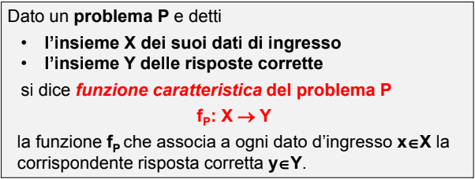
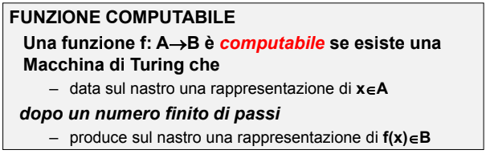
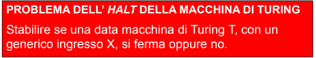
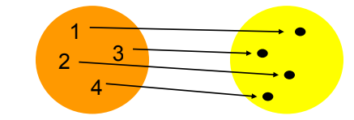

- # INTRODUZIONE
- #### PROGRAMMA
	- testo scritto secondo una sintassi di un qualche linguaggio di programmanzione
- #### ALGORITMO
	- sequenza di passaggi che risolvono un determinato problema
- ### AUTOMA ESECUTORE
	- caratteristiche
	- deve essere capace di interpretare un linguaggio
	- #### gerarchia macchine astratte
		- macchine diverse hanno diverse capacità di riconoscimento di linguaggi
		- 
		- ##### MACCHINA BASE
			- 
			- ###### LIMITI
				- macchina puramente combinatoria senza capacita di memoria
		- ##### AUTOMA A STATI FINITI
			- 
			- ###### LIMITI
				- la capacita di memoria della macchina è finita
				- non utilizzabile per problemi di cui non si è in grado di determinare a priori la memoria necessaria
		- ##### MACCHINA DI TURING
		  id:: 64235ae1-e3b1-43b1-b4ba-5ea864aad1c9
			- 
			- non è stato trovato un automa piu potente della macchina di turing
			- 
			- la macchina di turing non è in grado di risolvere qualunque problema
			- macchina non sempre necessario
		- ##### PUSH DOWN AUTOMATON
			- macchina di turing che prevede l'accesso al nastro dei dati solo dalla cima (comportamento a stack)
	- queste macchine hanno la logica risolutiva **cablata** all interno rendendole macchine specifiche alla soluzione di determinati problemi
	- #### MACCHINA DI TURING UNIVERSALE
		- macchina di turing il cui algoritmo è scritto sul nastro e la logica cablata all'interno della macchina diventa **INTERPRETARE IL LINGUAGGIO IN CUI VIENE SCRITTO L'ALGORITMO RISOLUTIVO**
		- {:height 220, :width 532}
		- ##### CONFRONTO CON LA MACCHINA DI VON NEUMANN
			- 
			- ###### DIFFERENZE
				- la macchina di turing non ha concetto di I/O a differenza della macchina di von neumann
				- ##### LINGUAGGI DI INTERAZIONE E COMPUTAZIONE
					- la computazione e la interazione può essere definita da due linguaggi differenti e ortogonali
	- ### TEORIA DELLA COMPUTABILITÀ
		- TODO completare primo pacco di slide
		- #### PROBLEMA RISOLUBILE
			- problema che puo essere risolto da una ((64235ae1-e3b1-43b1-b4ba-5ea864aad1c9))
		- #### FUNZIONE CARATTERISTICA
			- 
		- #### FUNZIONE COMPUTABILE
			- 
			- una funzione non computabile manda la ((64235ae1-e3b1-43b1-b4ba-5ea864aad1c9)) in loop
		- esistono funzioni non computabili?
			- ##### DIMOSTRAZIONE
				- l'insieme delle funzioni definite sui naturali **non è numerabile**
				- l'insieme delle funzioni computabili **è numerabile**
			- ##### ESEMPIO
				- 
				- problema non risolubile
		- necessario determinare se un linguaggio sia generabile e decidibile
		- #### INSIEME NUMERABILE
		  id:: 642ae0f6-e12d-480f-83ae-bceab9a20af5
			- insieme per cui esiste una funzione f:N->I
			- gli elementi possono essere contati
			- 
		- #### INSIEME RICORSIVAMENTE NUMERABILE (SEMI-DECIDIBILE)
			- ((642ae0f6-e12d-480f-83ae-bceab9a20af5)) la cui funzione può essere computata da una macchina di turing
			- la macchina di turing, dato un elemento dell'insieme è in grado di rispondere correttamente se l'elemento appartiene all'insieme ma **non è in grado di affermare se l'elemento non vi appartiene**
			-
			-
		-
		-