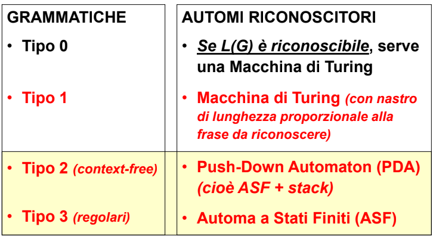
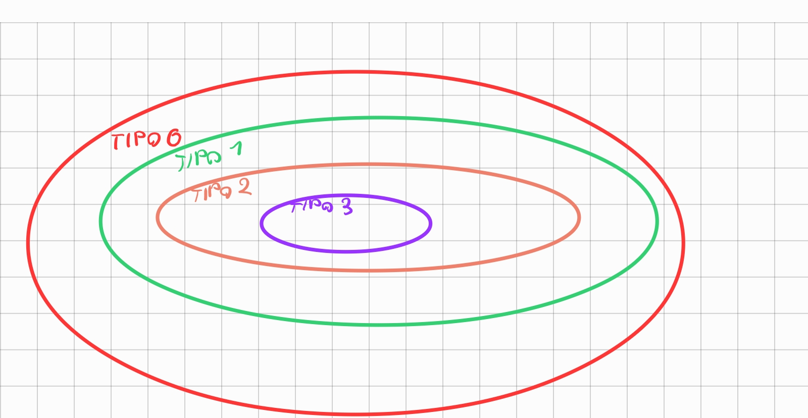

- ## [GRAMMATICHE DI TIPO 0](GRAMMATICHE%20DI%20TIPO%200.md)
- ## [GRAMMATICHE DI TIPO 1](GRAMMATICHE%20DI%20TIPO%201.md)
- ## [GRAMMATICHE DI TIPO 2](GRAMMATICHE%20DI%20TIPO%202.md)
- ## [GRAMMATICHE REGOLARI](GRAMMATICHE%20REGOLARI.md)

- ## CORRISPONDENZA TRA GRAMMATICHE E AUTOMA RICONOSCITORE
- 

- ## GERARCHIA TRA LE GRAMMATICHE
- 
	- ##### PROBLEMA DELLA STRINGA VUOTA
		- i linguaggi generati da [GRAMMATICHE DI TIPO 1](GRAMMATICHE%20DI%20TIPO%201.md) non ammettono produzioni con la stringa vuota ma quelle di tipo 2 e 3 si
		- data la relazione gerarchica grammatiche di tipo A possono generare linguaggi di tipo B con A>B **ma la grammatica di tipo A ha necessità computazionali più esose**
	- #### GRAMMATICHE MODERNE
		- le grammatiche dei linguaggi moderni sono di Tipo 2
	- ### DIFFERENZE TRA GRAMMATICHE DI TIPO 1 E 2
		- le grammatiche di tipo 2 non ammettono produzioni della forma
		- 
		- **non consentono di scambiare i simboli in una produzione**
	- ## DIFFERENZE TRA GRAMMATICHE DI TIPO 2 E 3
		- le produzioni di Tipo 2 **ammettono un metasimbolo in qualunque punto della frase**
		- le produzioni di tipo 3 **ammettono metasimboli solo a destra o a sinistra della frase**
		- 
	- quindi la caratteristica cruciale che differenzia le due grammatiche è il  self embedding
- le tipologie di grammatiche dalla 1 in avanti sono tutte riconoscibili
- entra in gioco l'efficienza del riconoscitore
- per ottenere traduttori efficienti si prendono in considerazione particolari classi di grammatiche di Tipo 2
	- il riconoscitore di questi linguaggi si chiama PDA(push down automaton)
- per un efficienza maggiore, in alcune parti del linguaggio si può adottare un riconoscitore di grammatiche di terzo livello
	- il riconoscitore di questi linguaggi si chiama macchina a stati finiti