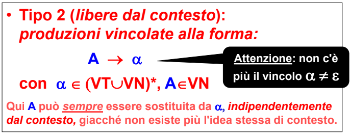
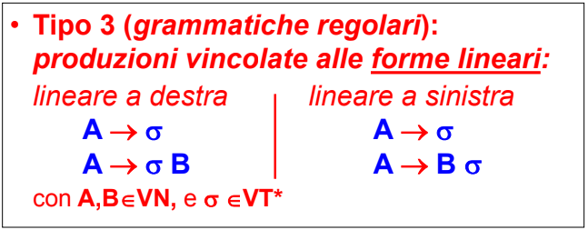
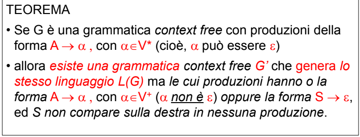
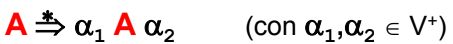

- #### TIPO 0
  id:: 642c29b2-f149-4873-bbd8-4510d428b9a6
	- nessuna restrizione sulle produzioni
	- le regole possono anche trasformare qualcosa in stringa vuota (*si accorcia la frase*)
	- i linguaggi generati non sempre sono comprensibili dalla macchina di turing
	- poco interessanti
	- ##### ESEMPIO
		- 
- #### TIPO 1 (CONTEXT NON FREE)
  id:: 642c29c2-668c-4acb-8739-4fadd42d5ff2
	- produzioni che non ammettono la riaccorciatura della frase (*nessuna produzione ammette mai la stringa vuota*)
	- 
	- si puo trasformare solo un metasimbolo per volta
- #### TIPO 2 (CONTEXT FREE)
  id:: 642c29c2-4d60-4457-b9db-7438513172a5
	- produzioni in cui un metasimbolo puo essere sostituito a prescindere dal contesto
	- 
	- viene rimosso il vincolo sull'accorciamento della frase
- #### TIPO 3 (GRAMMATICHE REGOLARI)
  id:: 642c29c3-4149-4191-9f19-40157695c700
	- grammatiche le cui  produzioni ammettono un solo simbolo non terminale nel membro di destra
	- 
- ad ogni grammatica corrisponde una macchina in grado di riconoscerne i linguaggi
- 
- le tipologie di grammatiche sono in **relazione gerarchica** fra di loro
	- 
	- ##### PROBLEMA DELLA STRINGA VUOTA
		- i linguaggi di tipo 1 non ammettono produzioni con la stringa vuota ma quelle di tipo 2 e 3 si
		- 
	- data la relazione gerarchica grammatiche di tipo A possono generare grammatiche di tipo B con A>B **ma la grammatica di tipo A ha necessità computazionali più esose**
	  id:: 642c3035-84b5-4342-ae58-733e4adb1423
	- #### GRAMMATICHE MODERNE
		- le grammatiche dei linguaggi moderni sono di ((642c29c2-4d60-4457-b9db-7438513172a5))
	- #### RAMI DI DERIVAZIONE MORTI
		- nelle grammatiche di ((642c29c2-668c-4acb-8739-4fadd42d5ff2)) è possibile arrivare a una stringa in cui non è possibile applicare altre produzioni (a differenza dei linguaggi di ((642c29c2-4d60-4457-b9db-7438513172a5)) e ((642c29b2-f149-4873-bbd8-4510d428b9a6)) )
	- caratteristica cruciale che differenzia ((642c29c2-668c-4acb-8739-4fadd42d5ff2)) e ((642c29c2-4d60-4457-b9db-7438513172a5))
		- le grammatiche di tipo due non ammettono produzioni della forma
		- 
		- **non consentono di scambiare i simboli in una produzione**
	- caratteristica cruciale che differenzia ((642c29c2-4d60-4457-b9db-7438513172a5)) e ((642c29c3-4149-4191-9f19-40157695c700))
		- le produzioni di ((642c29c2-4d60-4457-b9db-7438513172a5)) **ammettono un metasimbolo in qualunque punto della frase**
		- le produzioni di ((642c29c3-4149-4191-9f19-40157695c700)) **ammettono metasimboli solo a destra o a sinistra della frase**
		- #### SELF EMBEDDING
		  id:: 642c33fe-3798-4585-a979-188048ee8257
			- grammatica self-embedding quando contiene una produzione della forma
			  id:: 642c340a-3d55-451e-8b5a-746397822abe
				- 
			- 
			- utilità: generare una ricorsione dove si generano simboli sia a destra che a sinistra (*fondamentale per le parentesi :)*)
		- quindi la caratteristica cruciale che differenzia le due grammatiche è il ((642c33fe-3798-4585-a979-188048ee8257))
- le tipologie di grammatiche dalla 1 in avanti sono tutte riconoscibili
- entra in gioco l'efficienza del riconoscitore
- per ottenere traduttori efficienti si prendono in considerazione particolari classi di grammatiche di ((642c29c2-4d60-4457-b9db-7438513172a5))
	- il riconoscitore di questi linguaggi si chiama ((642ada1e-4190-452e-9205-b0e87b214a9d))
- per un efficienza maggiore, in alcune parti del linguaggio si può adottare un riconoscitore di ((642c29c3-4149-4191-9f19-40157695c700))
	- il riconoscitore di questi linguaggi si chiama ((642ad9cf-8b35-46b2-86b8-390bfb954859))