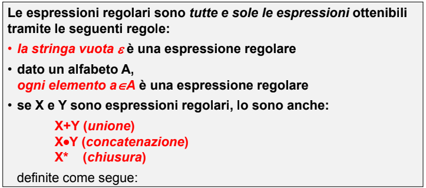
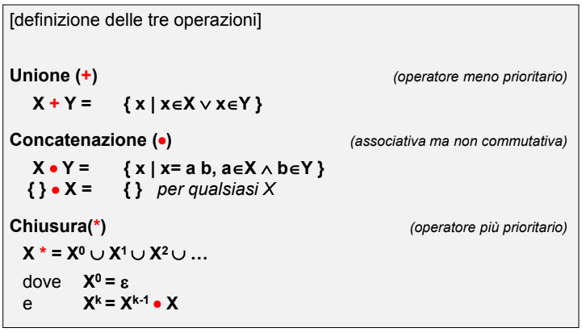
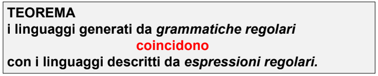
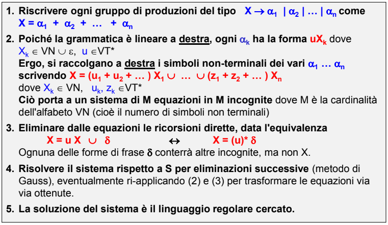

- Formalismo per distinguere una particolare tipologia di grammatiche dove
	- 
	- 
	- uno stesso linguaggio **può essere descritto da più espressioni regolari diverse**
	- #### TEOREMA SULLE ESPRESSIONI REGOLARI
		- 
	- rispetto a una grammatica di tipo 3, **l'espressione regolare mostra cosa si ottiene da un linguaggio** mentre la **grammatica mostra il come si ottiene**
	- #### PASSAGGIO FRA RAPPRESENTAZIONI
		- ##### DA GRAMMATICA A ESPRESSIONE REGOLARE
			- si risolvono le equazioni sintattiche
			- ##### ALGORITMO DI RISOLUZIONE
				- 
				-
		- ##### DA ESPRESSIONE REGOLARE A GRAMMATICA
			- si interpretano gli operatori dell'espressione regolare e si ricostruiscono le regole del linguaggio
		- #### RIFLESSIONE SULLE ESPRESSIONI REGOLARI
			- per un dato linguaggio esistono più espressioni regolari che lo descrivono, necessario trovare un **modo di ottenere espressioni equivalenti**
			-
		-