- notazione formale con cui definire la sintassi di un linguaggio
- 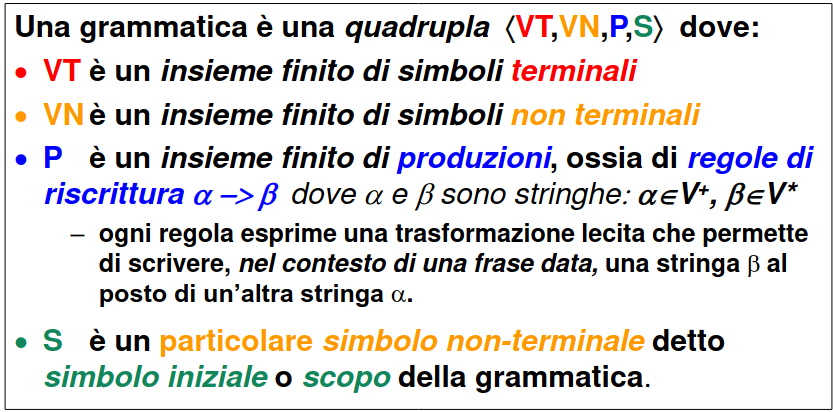
- #### FORMA DI FRASE
  id:: 642add78-79fd-400d-b5d3-aa7246164735
	- stringa composta da simboli e metasimboli
	- una ((642adbba-d26e-4362-a162-88775bd6a65c)) è una stringa composta da soli simboli terminali
- #### DERIVAZIONE
	- date due stringhe ((642add78-79fd-400d-b5d3-aa7246164735)) A e B
	- si dice che **B deriva direttamente da A** se
	- 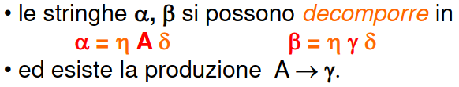
	- si dice che B deriva da A se
	- 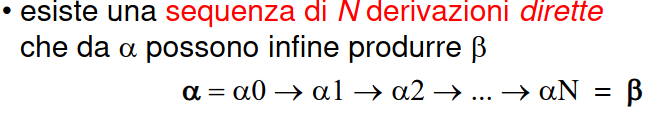
- ### LINGUAGGIO GENERATO DALLA GRAMMATICA
	- data una grammatica G si dice linguaggio Lg generato dalla grammatica G **l'insieme delle frasi derivabili dal simbolo inziale della grammatica applicando le sue produzioni**
	- 
- #### GRAMMATICHE EQUIVALENTI
	- una grammatica si dice equivalente a un altra **se produce lo stesso linguaggio** (*grammatiche equivalenti possono performare in maniera diversa*)
	- stabilire se due grammatiche sono equivalenti è un **problema indecidibile**
	- **grammatiche diverse** possono dar vita a linguaggi che richiedono automi con diverse proprietà e **potenza computazionale**
- [[CLASSIFICAZIONE DELLE GRAMMATICHE (DI CHOMSKY)]]
- ### NOTAZIONI PER GRAMMATICHE DI TIPO 2
	- ##### GRAMMATICHE BNF
		- 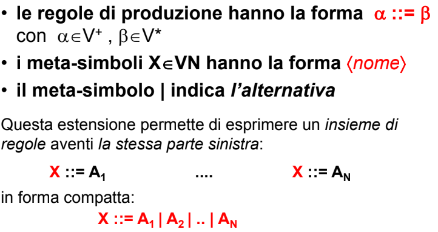
	- ##### GRAMMATICHE EXTENDED BNF
		- si introducono notazioni compatte per definire la ripetizione di uno o più elementi
		- 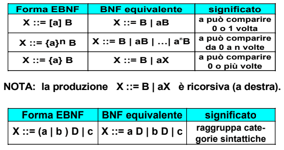
	- #### ALBERO DI DERIVAZIONE
		- per le grammatiche di ((642c29c2-4d60-4457-b9db-7438513172a5)) si introduce l'astrazione di albero di derivazione
		- ogni nodo è composto da u simbolo del vocabolario
		- la radice dell' albero coincide con lo scopo della grammatica
		- dato un nodo x e i suoi figli (a1.....ak) significa che la grammatica contiene le produzioni
		- 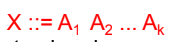
		- questa astrazione non è possibile per i linguaggi di ((642c29c2-668c-4acb-8739-4fadd42d5ff2)) e ((642c29b2-f149-4873-bbd8-4510d428b9a6)) perche ammettono regole di produzione con piu di un simbolo nel lato sinistro rendendo l'albero un grafo
		- ##### ESEMPIO
			- 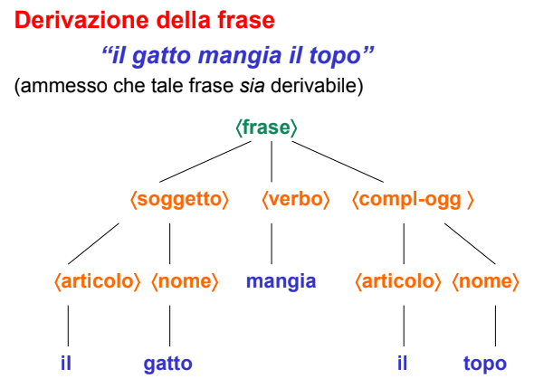
		- #### TIPOLOGIE DI DERIVAZIONE
			- ##### DERIVAZIONE LEFT-MOST
			  id:: 642c4f12-760e-45f0-85e9-864f3fd480f0
				- viene descritto il simbolo non terminale **più a sinistra**
			- ##### DERIVAZIONE RIGHT-MOST
				- viene riscritto il simbolo terminale **più a destra**
			- #### AMBIGUITÀ DI UNA FRASE
				- una frase è considerata ambigua quando ammette due ((642c4f12-760e-45f0-85e9-864f3fd480f0)) distinte
				- caratteristica problematica (*il riconoscitore non sa come comportarsi con queste frasi*)
				- ##### ESEMPIO
					- 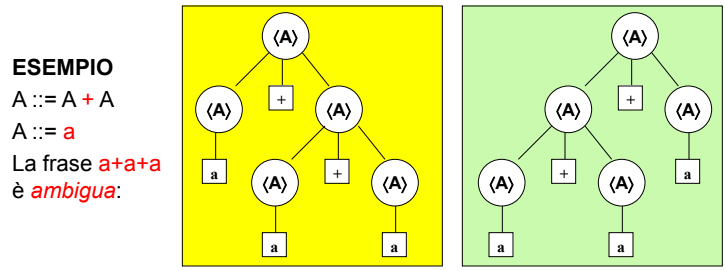{:height 218, :width 561}
				- stabilire se una grammatica di ((642c29c2-4d60-4457-b9db-7438513172a5)) sia ambigua è un **problema indecidibile**
				- #### LINGUAGGIO INTRINSECAMENTE AMBIGUO
					- quando non esistono grammatiche non ambigue per generarlo
		- #### STRINGA VUOTA
			- i linguaggi di ((642c29c2-4d60-4457-b9db-7438513172a5)) non ammettono la stringa vuota
			- tuttavia risulta utile per definire parti opzionali
			- può essere inclusa a patto che compaia solo nella produzione di top level S e S non compaia in nessun'altra produzione
			- 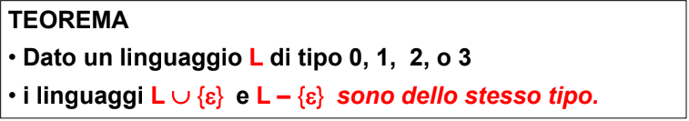
		- #### FORMA NORMALE
			- per ogni linguaggio di ((642c29c2-4d60-4457-b9db-7438513172a5)) può essere generato da una grammatica di tipo 2  che
				- non ha metasimboli inutili
				- non presenta produzioni che riscrivono un metasimbolo in un altro metasimbolo
				- se non è presente la stringa vuota allora non esistono produzioni che la includono
			- #### FORMA NORMALE DI CHOMSKY
				- produzioni della forma A->BC|a
			- #### FORMA NORMALE DI GREIBACH
			  id:: 642c5298-ad31-4ada-922b-f42ac92b52c8
				- per linguaggi senza stringa vuota
				- produzioni della forma A ->ac (*con c simbolo non terminale o stringa vuota*)
				- facilita la forma di riconoscitori
			- importante poter trasformare una grammatica in ((642c5298-ad31-4ada-922b-f42ac92b52c8))
			- #### TRASFORMAZIONI IMPORTANTI
				- ##### SOSTITUZIONE
					- eliminazione di un simbolo non terminale sfruttando un altra produzione
					- 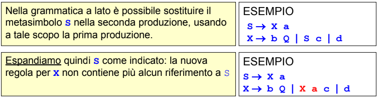
				- #####  RACCOGLIMENTO A FATTORE COMUNE
					- raccoglimento di parti comuni del membro di destra di una produzione
					- 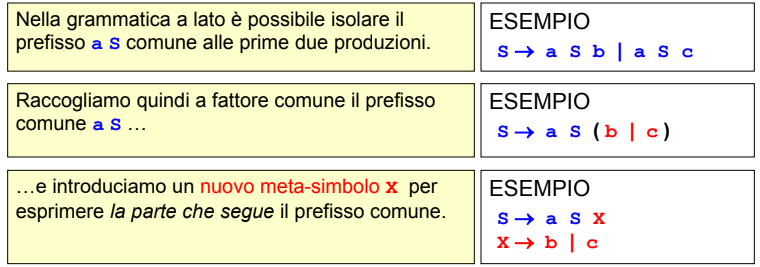
				- ##### ELIMINAZIONE DELLA RICORSIONE SINISTRA
					- vengono rimossi i cicli di ricorsione a sinistra e trasformata in ricorsione destra
					- 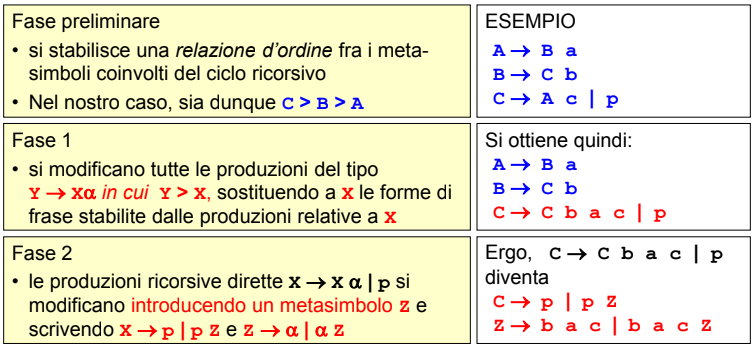
			- #### IL PROBLEMA DELLA RICORSIONE SINISTRA
				- nasconde il primo simbolo non terminale della frase costringendo a controllare le produzioni successive
				- 
				- la ricorsione sinistra genera complicanze per il riconoscitore  tuttavia risulta necessaria in alcuni contesti per motivazioni culturali (*si veda per esempio le espressioni matematiche che sono associative a sinistra*)
				- la rimozione della ricorsione sinistra implica una riscrittura esplicita delle regole del linguaggio, alterando la sequenza di riconoscimento delle frasi **questo non è accettabile quando si vuole attribuire un significato alla frase**
	- per poter definire riconoscitori effficienti è necessario saper [[RICONOSCERE LA TIPOLOGIA DI UN LINGUAGGIO]]