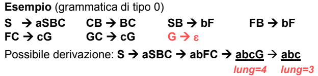

- nessuna restrizione sulle produzioni
	- le regole possono anche trasformare qualcosa in stringa vuota (*si accorcia la frase*)
	- i linguaggi generati non sempre sono comprensibili dalla macchina di turing
	- poco interessanti
	- ##### ESEMPIO
		- 
	- #### RAMI DI DERIVAZIONE MORTI
		- nelle grammatiche di Tipo 0 è possibile arrivare a una stringa in cui non è possibile applicare altre produzioni 