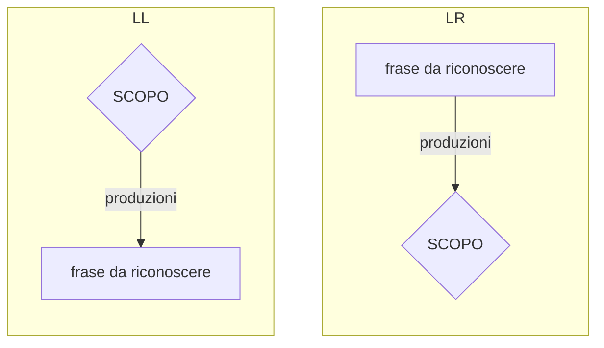
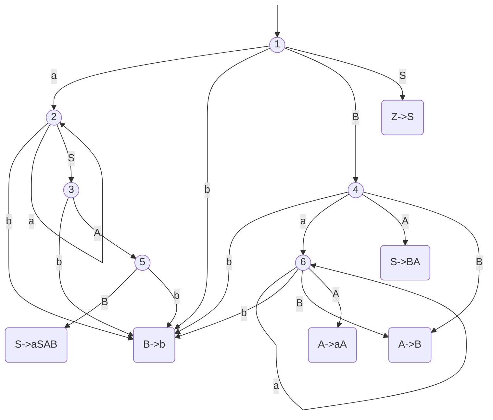

# ANALISI $LR(K)$

L' analisi [LL(k)](GRAMMATICHE_LLK.md#GRAMMATICHE%20$LL(k)$), costruendo l'albero top-down, necessita di dedurre la prossima mossa da intraprendere osservando i prossimi $k$ simboli di input, di conseguenza risulta utile solo nel caso di linguaggi con $k=1$ (*nel caso dell'assegnamento $k=2$*)

L'analisi $LR$ invece ribalta il paradigma ricostruendo l'albero in **bottom-up**

Questo approccio rende l'analisi LR si più potente, infatti l' insieme dei linguaggi [contex free](GRAMMATICHE_TIPO_2.md) riconoscibili per mezzo dell'[analisi LL](GRAMMATICHE_LLK.md#GRAMMATICHE%20$LL(k)$) e contenuto in quelli riconoscibili per mezzo dell' analisi LR.

Tuttavia l'analisi LR risulta **più complessa da progettare e computazionalmente più esosa**, esistono quindi tecniche che approssimano l'analisi LR come **SLR** o **LALR**

## ARCHITETTURA DI UN PARSER $LR$

Un parser $RL$ ricostruisce l'albero di derivazione della frase in analisi al contrario, di conseguenza necessita di comprendere quando sia necessario fare:

- un operazione di **SHIFT**  ovvero leggere da input un altro valore (*aggiungere all'albero una foglia*)
- un operazione di **REDUCE**  ovvero applicare al contrario una produzione (*costruire un nodo padre da 1 o più nodi figli*)

La decisione viene presa in base a un **contesto corrente** (*stato*) in cui il riconoscitore si trova a operare

Il componente software imputato di tale compito e il **RICONOSCITORE DI CONTESTI**

## ANALISI $LR(0)$

Nel caso dell'analisi $LR$ e utile partire con il caso in cui $k=0$ ovvero non ci sono informazioni sul futuro, che nel caso dell' [analisi LL](GRAMMATICHE_LLK.md#GRAMMATICHE%20$LL(k)$) non aveva senso ma nel caso dell'analisi $LR$ si ha sempre l'informazione di contesto che può guidare il parser

## CONTESTI $LR(0)$

Vengono di conseguenza definiti i contesti $LR(0)$:

data una produzione della forma $A \rightarrow \alpha$ l'inseme dei contesti $LR(0)$ e cosi definito

$$
LR(O)ctx(A \rightarrow \alpha) = \{\gamma | \gamma = \beta\alpha, Z \overset{*}\Rightarrow \beta Aw \Rightarrow \beta\alpha w, \space con \space w \in VT^*\}
$$

ovvero tutti i simboli che possono comparire a sinistra in una forma di frase nel momento in cui viene applicata la produzione $A \rightarrow \alpha$, data questa definizione **tutti i contesti differiscono solo per il prefisso $\beta$** (*utile per calcolare l'insieme*)

### CONTESTI SINISTRI DI UNA PRODUZIONE

Data la definizione  di cui sopra e possibile calcolare i contesti di una data produzione come concatenazione dell'insieme dei $\beta$ e del valore $\alpha$, l'insieme dei $\beta$ e detto l'insieme dei **contesti sinistri di $A \rightarrow \alpha$**

$$
leftctx(A) = \{\beta |  Z \overset{*}\Rightarrow \beta Aw, \space con \space w \in VT^*\}
$$

Quindi per trovare i contesti $LR(0)$ e sufficiente trovare i contesti sinistri delle varie produzioni e concatenarli con il valore delle produzioni stesse

### CALCOLO DEI CONTESTI SINISTRI

Data la produzione $B \rightarrow \gamma A\delta$ si può dire che uno dei contributi al contesto sinistro di $A$ e dato dai contesti sinistri di $B$ concatenati al simbolo $\gamma$ :

$$
leftctx(A) \supseteq leftctx(B) \bullet \{\gamma\}
$$

Il ragionamento si può iterare fino a risalire allo scopo della grammatica che per definizione ha $leftctx(Z)=\{\epsilon\}$, inoltre dai due postulati si deriva che la **grammatica dei contesti e sempre [regolare a sinistra](ESPRESSIONI_REGOLARI.md#ESPRESSIONI%20REGOLARI%20E%20GRAMMATICHE)** (*riconoscibile da un [RSF](RSF.md#AUTOMA%20A%20STATI%20FINITI)*)

Data la grammatica che segue:

$$
Z \rightarrow S
$$
$$
S \rightarrow aSAB | BA
$$
$$
A \rightarrow aA | B
$$
$$
B \rightarrow b
$$

Applicando quanto detto prima si ottengono i seguenti contesti sinistri

$$
leftctx(Z) \rightarrow \{ \epsilon \}
$$
$$
leftctx(S)   \rightarrow LctxZ | LctxS \bullet a
$$
$$
leftctx(A)   \rightarrow LctxS \bullet as| LctxS \bullet B | LctxA \bullet a
$$
$$
leftctx(B)   \rightarrow LctxS \bullet aSA| LctxS | LctxA
$$

Dati i contesti sinistri se i corrispondenti [CONTESTI LR(0)](#CONTESTI%20$LR(0)$) non collidono l'automa riconoscitore sara deterministico

## TABELLA DI PARSING $LR(0)$

La tabella di parsing puo essere ricostruita con le seguenti regole

- per ogni arco $S_1 \rightarrow S_2$ con input il simbolo terminale a, si inserisce in tabella alla posizione $(S1, a)$ l’azione shift to $S2$
- per ogni arco $S_1 \rightarrow S_2$ con *input* (da stack) il metasimbolo $X$, si inserisce in tabella alla posizione $(S_1, X)$ l’azione goto $S_2$
- per ogni stato $S_i$ associato alla regola $R$-esima, $A \rightarrow \alpha$. si inserisce in tabella l’azione reduce $R$ in tutta la riga corrispondente allo stato Si
- per ogni stato Si contenente la produzione $Z \rightarrow S.\$$ si inserisce in tabella alla posizione $(S_i , \$)$ l’azione accept

Quindi per l'automa precedente si ha la seguente tabella di parsing

|        | $a$   | $b$      | $\$$  | $S$      | $A$      | $B$      |
| ------ | ----- | -------- | ----- | -------- | -------- | -------- |
| **1**  | $s_2$ | $s_{11}$ |       | $g_{10}$ |          | $g_{4}$  |
| **2**  | $s_2$ | $s_{11}$ |       | $g_{3}$  |          | $g_{4}$  |
| **3**  | $s_6$ | $s_{11}$ |       |          | $g_{5}$  | $g_{12}$ |
| **4**  | $s_6$ | $s_{11}$ |       |          | $g_{13}$ | $g_{12}$ |
| **5**  |       | $s_{11}$ |       |          |          | $g_{15}$ |
| **6**  | $s_6$ |          |       |          | $g_{14}$ | $g_{12}$ |
| **10** |       |          | $a$   |          |          |          |
| **11** | $r_1$ | $r_1$    | $r_1$ |          |          |          |
| **12** | $r_2$ | $r_2$    | $r_2$ |          |          |          |
| **13** | $r_3$ | $r_3$    | $r_3$ |          |          |          |
| **14** | $r_4$ | $r_4$    | $r_4$ |          |          |          |
| **15** | $r_5$ | $r_5$    | $r_5$ |          |          |          |

## RICONOSCITORI PER LINGUAGGI $LR(0)$

I riconoscitori per i linguaggi $LR(0)$ data la forma di frase corrente operano come segue:

- eseguono **SHIFT** se lo stato dell'automa non e terminale e pongono nello stack il simbolo terminale letto da input
- eseguono **REDUCE** se lo stato dell'automa e terminale e poppano dallo stack i simboli corrispondenti della parte destra della produzione applicata e pongono nello stack il metasimbolo della parte sinistra (*non avvengono letture da input*)

ogni volta che avviene una riduzione l'automa riparte dall'inizio

### OTTIMIZZAZIONE, LO STACK DEGLI STATI

Per ottimizzare si può disporre di uno **stack degli stati** dove accumulare via via gli stati attraversati dall'automa e in fase di reduce rimuoverne tanti quanti i simboli della parte destra della produzione, in questo modo si evita di far ricominciare l'automa dall'inizio

## CONDIZIONE SUFFICIENTE PER ANALISI $LR(0)$

Per poter effettuare con successo l'analisi $LR(0)$ date due produzioni $A \rightarrow \alpha$ e $B \rightarrow \omega$  se:
$$\theta \in LR(0)ctx(A \rightarrow \alpha)$$
e
$$\theta w \in LR(0)ctx(B \rightarrow \omega)$$
allora deve essere vero che

$$
w=\epsilon, \space A=B, \space \alpha=\omega
$$

Ovvero ogni stato di riduzione dell'automa non deve avere archi uscenti caratterizzati da non terminali e sia etichettato

## LIMITI DELL'ANALISI $LR(0)$

l'analisi $LR(0)$ presenta dei limiti intrinsechi dovuti al fatto di ragionare solo sul contesto corrente e non avere **nessuna informazione sui simboli in input successivi**, per questo le grammatiche utili che rispettano la [condizione sufficiente per analisi lr(0)](#CONDIZIONE%20SUFFICIENTE%20PER%20ANALISI%20$LR(0)$) non sono molte, per ottenere un riconoscitore utile e necessario **vedere nel futuro**

## ANALISI $LR(k)$

L'analisi $LR(k)$ opera secondo le stesse logiche di [analisi LR(0)](#ANALISI%20$LR(0)$) estendendone le definizioni e ritardando le regole di riduzione di $k$ simboli, tuttavia la complessità data dal numero di stati dell'esecutore risulta di difficile gestione anche nel caso $k=1$ e richiede semplificazioni (*come $SRL$ o $LALR$*) le casistiche con $k\gt 1$ non sono neanche pensabili

### ESTENSIONE DELLE DEFINIZIONI DI CONTESTO

Il contesto $LR(k)$ viene cosi definito

$$
LR(k)ctx(A \rightarrow \alpha) = \{\gamma | \gamma = \beta\alpha u, Z \overset{*}\Rightarrow \beta Auw \Rightarrow \beta\alpha uw, \space con \space w \in VT^*\}
$$

> *si aggiunge una stringa di lunghezza $k$ dopo il simbolo non terminale della produzione $u$*

La stringa in questione appartiene all'insieme $FOLLOW_k(A)$ definito come segue:

$$
FOLLOW_K(A)= \{k \in VT^k| S \overset{*}\Rightarrow \gamma Ak\beta \}
$$

> il caso $k=1$ e quanto introdotto parlando di [riconoscitori LL](GRAMMATICHE_LLK.md#DIRECTOR%20SYMBOLS%20SET)

### AUTOMA RICONOSCITORE

L'automa riconoscitore si sviluppa similmente a quanto visto per il caso $k=0$ tuttavia il numero di stati dell'automa aumenta esponenzialmente con il numero di metasimboli e terminali dato che il numero di metasimboli della grammatica dei contesti sinistri e dato da:

$$
(n-1)\times t^k +1
$$

con $t$ simboli terminali e $n$ simboli non terminali della grammatica

## APPROSSIMANDO $LR(0)$

L'analisi $LR(1)$ per quanto potente risulta troppo complessa nel caso pratico, l'idea di base e quella di semplificare accorpando gli stati dell'automa che risultano simili fra loro

## SIMPLE LR (SLR)

Simple LR mira a semplificare l'automa riconoscitore, i contesti $SLR(0)$ sono cosi definiti

$$
SLR(k)ctx(A \rightarrow \alpha) = LR(0)ctx(A \rightarrow \alpha) \bullet FOLLOW_k(A)
$$

Si puo dunque calcolare facilmente a partire dal contesto $LR(0)$ inoltre e vero che:

$$
SLR(k)ctx(A \rightarrow \\alpha) \supseteq LR(k)ctx(A \rightarrow \alpha)
$$

ovvero il contesto SLR è un po' più grande, e quindi più esposto a potenziali conflitti, del contesto LR completo

## Look-Ahead LR (LALR)

Un altra idea consiste nel accorpare assieme gli stati del parser $LR(1)$ identici al netto dei look-ahead set:

- **PRO**: è una trasformazione sempre possibile, spesso molto conveniente perché il parser LALR ha molti meno stati dell'LR

- **CONTRO**: possono apparire conflitti reduce/reduce, tipicamente gestibili.

[PREVIOUS](pages/INTERPRETI.md) [NEXT](pages/PROCESSI_COMPUTAZIONALI.md)
