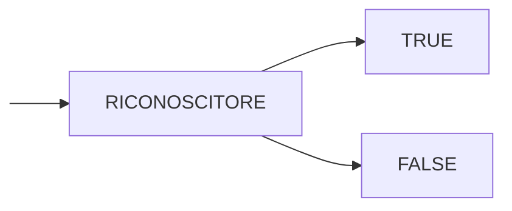
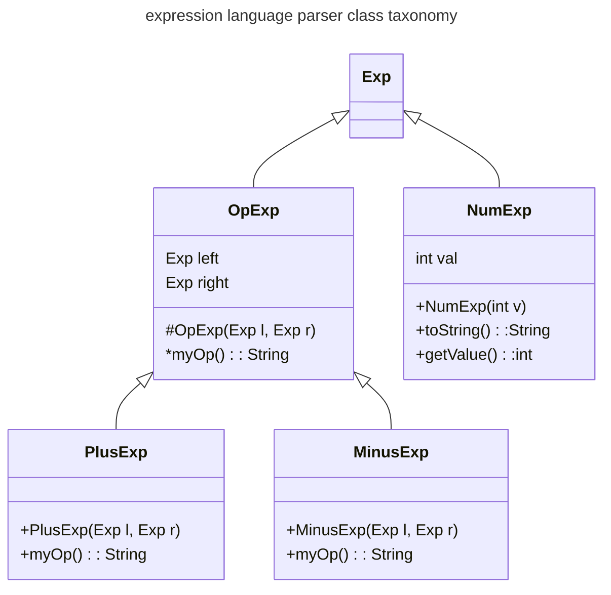
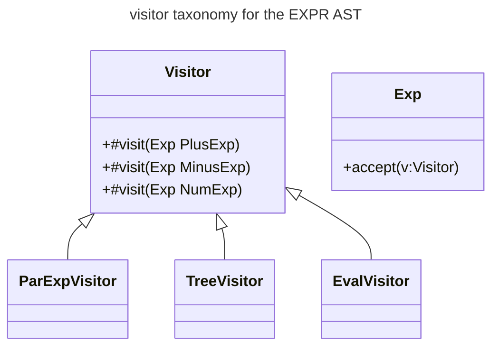
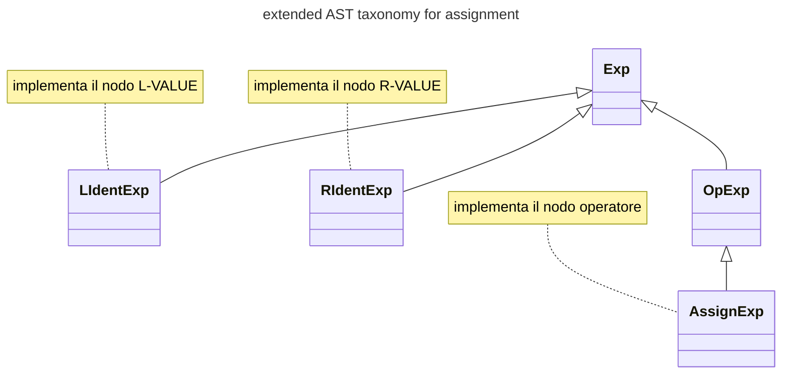
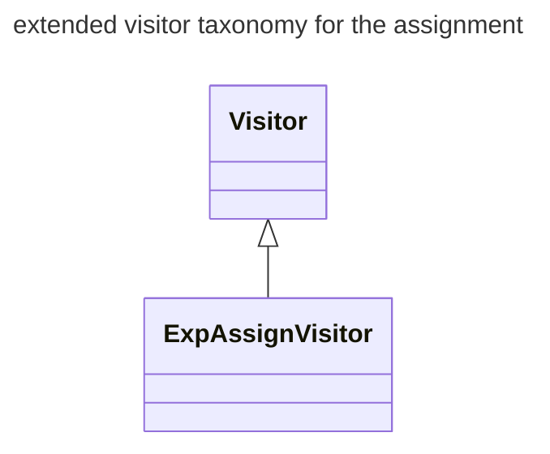

# INTERPRETI

Riconoscere se una frase appartiene o meno a un linguaggio non e sufficiente, e necessario applicare anche una semantica alle frasi riconosciute



Gli interpreti suggeriscono quindi di usare la struttura generata da uno scanner/lexer per poi applicare un significato alle frasi, in questo caso la sequenza di derivazione delle frasi e fondamentale in quanto da essa dipende la semantica applicata (*[ricordiamo il caso della ricorsione sinistra](GRAMMATICHE_TIPO_2.md#PERCHÉ%20NON%20ELIMINARE%20SEMPRE%20LA%20RICORSIONE%20SINISTRA)*)

## DESCRIVERE LA SEMANTICA

E necessario scrivere un formalismo che ci consenta di esprimere la semantica da associare alle singole frasi riconosciute dal parser

Questo viene fatto per mezzo di una funzione di interpretazione che mappi gli elementi del linguaggio (*DOMINIO*) all'insieme dei possibili significati (*CODOMINIO*)


Per implementare una tale funzione si sfrutta la struttura data dalla grammatica e si **esprime una funzione per ogni regola sintattica**:

### IMPLEMENTAZIONE

Una possibile implementazione puo essere ottenuta seguendo le regole sintattiche e definendo una regola semantica per ognuna di esse:

```java
// FUNZIONE PER IL PARSING DELLE REGOLE 
//EXP:= TERM + TERM
//EXP:= TERM - TERM
public int parseExp(){
//Cerca una sequenza di TERMINI.
//Si ferma quando trova un token non
//pertinente al suo sotto-linguaggio o
//quando la stringa di input termina
	int t1 = parseTerm();
	while (currentToken != null){
		if (currentToken.equals("+")) {
			currentToken = scanner.getNextToken();
			int t2 = parseTerm();
			t1 = t1+t2;
		}
		else if (currentToken.equals("-")) {
			currentToken = scanner.getNextToken();
			int t2 = parseTerm();
			t1 = t1-t2;
		}
		else return t1;
	} 
	return t1;
}
```

## INTERPRETAZIONE DIFFERITA (ABSTRACT SYNTAX TREE)

Nel caso non si intenda eseguire immediatamente la semantica ma generare un output eseguibile in un secondo momento (*compilatori/linguaggi misti*) e necessario definire una rappresentazione della frase interpretata (*solitamente un albero*)

si potrebbero usare gli [alberi di derivazione](GRAMMATICHE_TIPO_2.md#ALBERI%20DI%20DERIVAZIONE) ma questi risultano ridondanti e inefficienti, si ricorre quindi a una rappresentazione ridotta chiamata **abstract syntax tree**

Alcuni degli elementi che possono essere rimossi dal albero sono:

- nodi terminali privi di significato semantico (*punteggiatura*)
- nodi non terminali con un unico figlio (*$EXPR\rightarrow NUM$*)
- nodi terminali senza significato (parentesi)


## SINTASSI ASTRATTA

Occorre un formalismo per poter descrivere la struttura [AST](#INTERPRETAZIONE%20DIFFERITA%20(ABSTRACT%20SYNTAX%20TREE)), questo viene fatto per mezzo di una sintassi che descrive l'output del parser questa non deve essere non ambigua in quanto descrive l'output del parser, non lo guida al riconoscimento della frase

Di conseguenza, l'output del parser sara un albero composto da istanze di una data classe in base a cosa viene definito dalla sintassi dell' AST

### IMPLEMENTAZIONE

Una possibile implementazione può essere ottenuta partendo dal concetto precedente con la seguente gerarchia di classi



In cui ogni classe implementa in metodi per la generazione del singolo sottonodo dell [AST](#INTERPRETAZIONE%20DIFFERITA%20(ABSTRACT%20SYNTAX%20TREE))

## VALUTARE GLI ALBERI

Gli [AST](INTERPRETI.md#INTERPRETAZIONE%20DIFFERITA%20(ABSTRACT%20SYNTAX%20TREE)) prodotti da un parser necessitano di essere di conseguenza interpretati tramite opportune operazioni di visita degli alberi, 3 possibili approcci:

- **PRE-ORDER**: si visitano prima il nodo radice e poi figlio di destra e sinistra
- **POST-ORDER**: si visitano prima i figli e poi la radice
- **IN-ORDER**: si visita figlio di sinistra radice e figlio di destra

|                        | POST-ORDER  | PRE-ORDER   | IN-ORDER                               |
| ---------------------- | ----------- | ----------- | -------------------------------------- |
| **NOTAZIONE GENERATA** | `34+5+78*+` | `+34+5+*78` | `((3+4)+5)+7*8` *parentesi necessarie* |

la casistica **in-order** genera un output in notazione infissa che risulta ambiguo per un esecutore, la migliore soluzione risulta essere la visita post-order dato che in questo modo l'albero visitato genera un output in notazione postfissa

## PERCHÉ LA NOTAZIONE POSTFISSA

La notazione postfissa ha un vantaggio intrinseco in quanto dispone in ordine operandi e poi operatore, **che e esattamente l'ordine richiesto da una cpu per svolgere le operazioni** 

```
load a, r1
load b, r2
sum r1,r2,r3
```

questa notazione può essere eseguita anche per mezzo di una macchina a stack

```
push a
push b
pop a,b
push a+b
```

## IMPLEMENTAZIONE

L'implementazione può essere condotta con 2 possibili approcci

### APPROCCIO FUNZIONALE

si definisce una funzione che dato un nodo dell'albero ne computa la valutazione, con questa soluzione risulta semplice estendere con altre interpretazioni ma possiede scarsa leggibilità ed e molto error prone

```java
public static int eval(Exp e) {
// CODICE PER LA VALUTAZIONE (SWITCHCASE ENORME CON INSTANCEOF)
}
```

### APPROCCIO OOP

Ogni specializzazione dell'interfaccia `Expr` definisce i metodi per la generazione del proprio nodo dell [AST](INTERPRETI.md#INTERPRETAZIONE%20DIFFERITA%20(ABSTRACT%20SYNTAX%20TREE)), molto più leggibile e modulare ma rende complesso fornire interpretazioni diverse dello stesso [AST](#INTERPRETAZIONE%20DIFFERITA%20(ABSTRACT%20SYNTAX%20TREE)) 

```java
public Interface Expr{
	// le sottoclassi implementano 
	// la specifica semantica di eval per il corrispettivo nodo
	public abstract int eval(Exp e)
}
```


## LA SOLUZIONE: VISITORS

Per ovviare ai problemi delle implementazioni precedenti si introduce il pattern visitor che consente di incapsulare la logica di interpretazione in una singola funzione ma strutturandola in base alla tassonomia dell AST generato



Ogni visitor implementa una specifica interpretazione di tutti i possibili nodi dell'AST (*un metodo per ogni classe della tassonomia*), inoltre la interfaccia madre della tassonomia espone un metodo accept che esegue il metodo visit del visitor passando la propria istanza come parametro (**DOUBLE  DISPATCH**)

```java
void accept(Visitor v){
	v.visit(this);
}
```

# BELLE LE ESPRESSIONI MA DEVO POTER DIRE `x=x+1` (ASSEGNAMENTO)

L'assegnamento e uno dei costrutti onnipresenti in qualunque linguaggio di programmazione, non e ne simmetrico ne riflessivo e i simboli che compaiono da entrambe le parti dell'espressione hanno un significato molto diverso

> `x=..` il membro di sinistra specifica **un contenitore** 

> `...=x` il membro di destra invece specifica **il valore di un contenitore**

## DISTINZIONE FRA $L$-VALUE E $R$-VALUE

Quanto detto prima porta a definire la distinzione fra il valore di destra e di sinistra:

- $L$-VALUE per indicare gli identificatori a sinistra dell'operazione di assegnamento
- $R$-VALUE per indicare gli identificatori a destra dell'operazione di assegnamento

E inoltre opportuno considerare se distinguere i due valori sintatticamente in quanto la grammatica risultante in caso di non distinzione diventa [LL(2)](GRAMMATICHE_LLK.md#GRAMMATICHE%20$LL(k)$)

## ASSEGNAMENTO DISTRUTTIVO VS ASSEGNAMENTO NON DISTRUTTIVO

L'assegnamento puo essere inteso con 2 differenti semantiche:

- **distruttivo**: due assegnamenti con lo stesso membro di sinistra causano una riscrittura (*scelta preferita del paradigma imperativo*)
- **non distruttivo**: due assegnamenti con lo stesso membro di sinistra causano un errore (*scelta preferita del paradigma dichiarativo*)

## ENVIRONMENT

Per poter implementare correttamente l'assegnamento e necessario introdurre il concetto di environment, ovvero una mappa chiave valore dove salvare $L$-VALUE $R$-VALUE


| $L$-VALUE | $R$-VALUE |
| --------- | --------- |
| `a`       | `3`       |
| `y`       | `5`       |
| ...       | ...       |

In questo modo la semantica dell'assegnamento diventa

> *modifica la cella dell' environment indicizzata dal $L$-VALUE con il valore indicato da $R$-VALUE se presente, altrimenti creala*

### MULTIPLI ENVIRONMENT

Nei linguaggi di programmazione moderni vengono sfruttati multipli ambienti in modo da limitare la vita delle variabili al tempo di vita delle strutture dati che le hanno create (*scope*)

## ASSEGNAMENTO: ISTRUZIONE O ESPRESSIONE

Un'altra fondamentale decisione da prendere e specificare se l'assegnamento sia un espressione (*ritorna un valore*) o un istruzione (*non ritorna un valore*) questo e fondamentale perché implica il supporto o meno all'assegnamento multiplo


In caso di espressione infatti l'assegnamento ritorna l' $R$-VALUE che può essere utilizzato per assegnarne il valore a cascata (*associatività a destra*)

```c
x=y=z=5
```

che diventa:

| $L$-VALUE | $R$-VALUE |
| --------- | --------- |
| `x`       | `5`       |
| `y`       | `5`       |
| `z`       | `5`       |

tuttavia cio non e possibile con un assegnamento inteso come istruzione

### IMPLEMENTAZIONE

Tutto cio si traduce in un estensione dell [AST](#INTERPRETAZIONE%20DIFFERITA%20(ABSTRACT%20SYNTAX%20TREE)) con le classi per rappresentare gli oggetti sopracitati



Viene poi estesa la classe visitor con una specializzazione che aggiunge i metodi utili per i nodi della tassonomia per l'assegnamento



```java
interface ExpAssignVisitor extends Visitor {
	public abstract void visit( AssignExp e );
	public abstract void visit( LIdentExp e );
	public abstract void visit( RIdentExp e );
}
```

L'environment può essere realizzato sfruttando l'implementazione diretta delle mappe di java `Map<String,Integer>`

[PREVIOUS](pages/GRAMMATICHE_LLK.md) [NEXT](pages/GRAMMATICHE_LRK.md)
