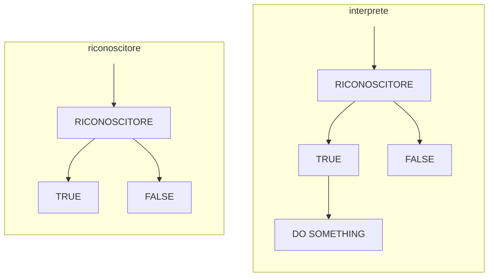

# INTERPRETI

Riconoscere se una frase appartiene o meno a un linguaggio non e sufficiente, e necessario applicare anche una semantica alle frasi riconoscute

Gli interpreti suggeriscono quindi di usare la struttura generata da uno scanner/lexer per poi applicare un significato alle frasi, in questo caso la sequenza di derivazione delle frasi e fondamentale in quanto da essa dipende la semantica applicata (*[ricordiamo il caso della ricorsione sinistra](GRAMMATICHE_TIPO_2.md#PERCHÉ%20NON%20ELIMINARE%20SEMPRE%20LA%20RICORSIONE%20SINISTRA)*)
