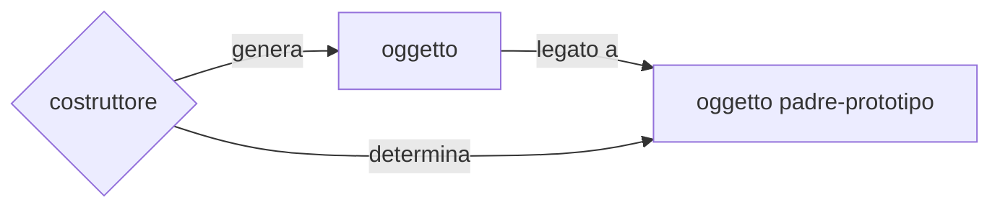
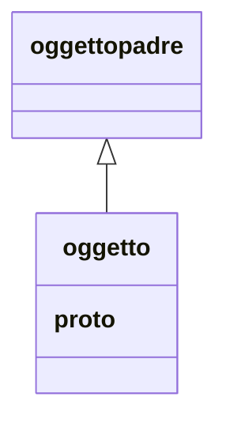
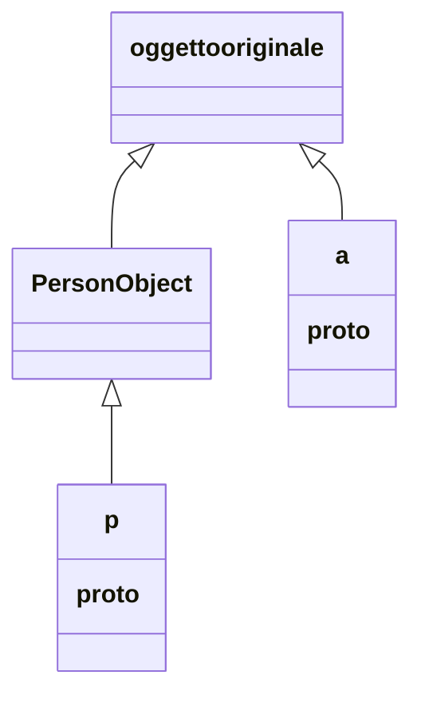
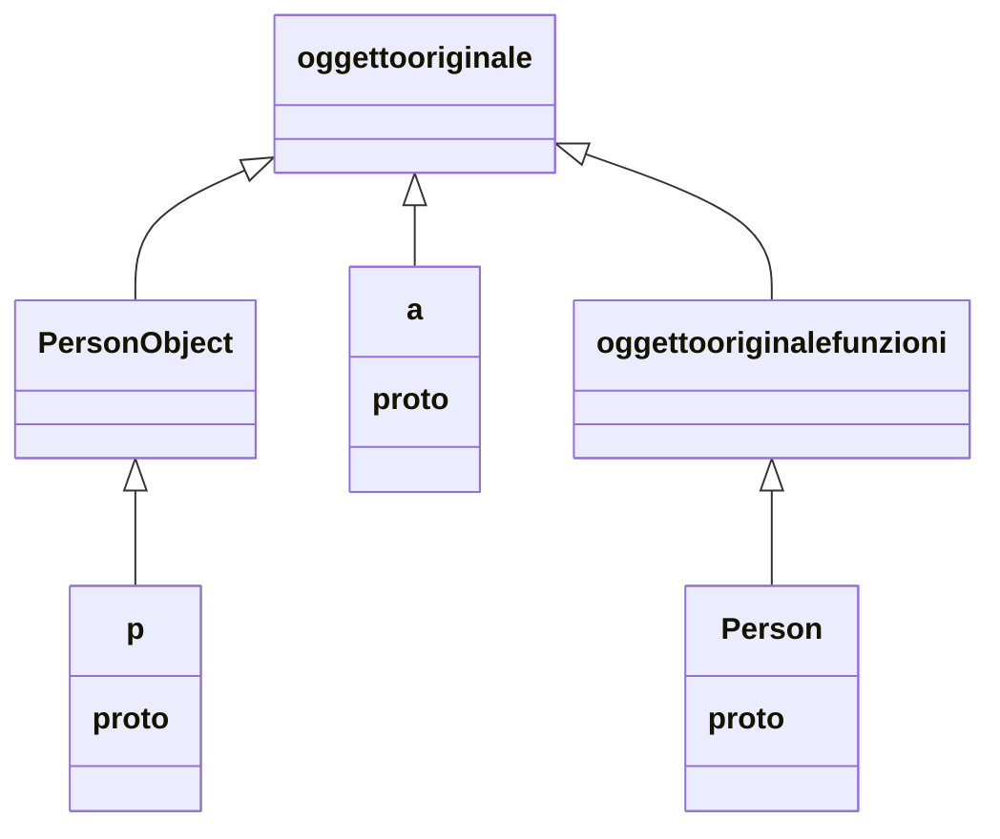
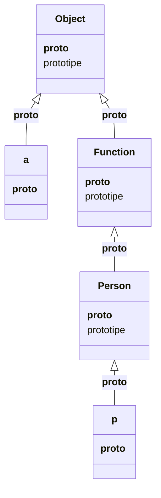

>eh beh era anche ora di impararlo..... stavolta sul serio
# JAVASCRIPT

Linguaggio con un approccio funzionale con funzioni e chiusure semplice e pratico, con una sintassi leggera, adotta un modello object-based senza classi, basato sul concetto di prototipo è un linguaggio interpretato, con aspetti dinamici di grande interesse

Ci sono anche dei contro dovuti alla giovinezza e alla crescita troppo rapida:

- un ambiente globale (*mal definito*) con variabili globali
- alcuni operatori contorti
- richiede disciplina per evitare stili che non rispettano le buone pratiche
- Perché offre alcune caratteristiche controverse
- il loose typing riduce le possibilità di intercettare errori di tipo,
- l'ereditarietà prototype-based è concettualmente potente, ma non facile da applicare per chi viene da linguaggi "class based"

## CRASH COURSE: LE BASI

### TIPI

Il tipo `string` denota stringhe di caratteri Unicode **no tipo char** (*un carattere è una stringa lunga 1*), le stringhe sono **oggetti immutabili** (*java maniera*), l'operatore `+` le concatena 

```javascript
console.log("hello" + "world")
console.log("hello" + 3)
```

Il tipo `number` denota un reale a 64 bit **no interi** (*la divisione è sempre fra reali, anche con operandi interi*),gli operatori bit a bit **operano su interi ottenuti convertendo sul momento il valore reale** (*lentissimi e inefficienti*)

- la costante `NaN` rappresenta il "risultato" di operazioni matematiche impossibili: non è uguale a nulla, incluso lei stessa, un'operazione che coinvolga un `NaN` dà come risultato `NaN`
- la costante Infinity rappresenta un valore maggiore del massimo reale positivo rappresentabile ($1.79 * 10+308$)

Costanti boolean: `true` e `false`, Altre costanti: `null` e `undefined` (*valore indefinito restituito da funzioni che non restituiscono nulla e assegnato a variabili prima della loro valorizzazione*)

### ESPRESSIONI

espressioni numeriche: somma, sottrazione, prodotto, divisione (*sempre fra reali*), modulo, shift (*come in java*)
- espressioni condizionali con ? … :
- espressioni stringa: concatenazione con +
- espressioni di assegnamento: con = (e sue varianti)

```javascript
document.write(18/4) // fra reali
document.write(18%2)
document.write("paolino" + 'paperino')
```

### VARIABILI

Le variabili in Javascript sono **loosely typed** ovvero è possibile assegnare alla stessa variabile prima un valore di un tipo, poi un valore di un altro tipo

```javascript
alfa = 19
beta = "paperino"
alfa = "zio paperone" // tipo diverso!!
```

Sono consentiti incrementi, decrementi e operatori di assegnamento estesi (`++`,`--`, `+=` … )

La dichiarazione di una variabile può essere implicita (*la si usa e basta*) o esplicita (*con la parola chiave var*)

```javascript
pluto = 18
var pippo = 19
```

Lo scope delle variabili è:
- locale, in caso di dichiarazione esplicita dentro a funzioni
- globale, in tutti gli altri casi

A differenza di Java, **un blocco non delimita uno scope** (*variabili definite dentro a blocchi innestati sono comunque riferite all'ambiente che le contiene*)

```javascript
x = '3' + 2; // la stringa '32'
{
	{ x = 5 } // blocco interno
	y = x + 3; // x denota 5, non "32"
}
```

Il tipo di una variabile **non è fissato a priori**: dipende dal contenuto attuale della variabile (*per scoprire il tipo `typeof()`*)

```javascript
a=18;
typeof(a) //dà number
a="ciao"; 
typeof(a) //da string
typeof(18/4) //da number
typeof("aaa")//da string
typeof(false)//da boolean
typeof(document)//da object
typeof(document.write)//da function

// questo invece da object
typeof([1,2,3]) 
```

Le istruzioni sono separate o da un punto e virgola (*come in C o Java*) o da un fine riga (*come in Pascal*)

```javascript
alfa = 19
// fine riga
beta = "paperino" ; gamma = true
document.write(beta + alfa)
// fine riga
```

```javascript
//ATTENZIONE: se si va a capo dove non si deve, rischio di semicolon insertion
return 18; // restituisce 18
return // restituisce undefined
18;// (statement irraggiungibile)
```

### STRUTTURE DI CONTROLLO

Solite strutture `if`, `switch`, `for`, `while`
• Costrutti per operare su oggetti: `for/in` e `with` (*il `for/in` itera sui nomi degli elementi, non sugli elementi stessi*)

```javascript
var array=[34,5,6]
for (val in array){
	console.log(val) //stampa l'indice non il valore
}
for (val in array){
	console.log(array[val]) //stampa il valore
}
```

### OPERATORI

I Soliti  (`==`,`!=`,`>`,`<`,`>=`,`<=`)  e anche AND (`&&`), OR (`||`), NOT (`!`)

Nella valutazione si considera **falso non solo il valore `false`**, ma ogni valore falsy ovvero anche `null`, `undefined`, la stringa vuota `''`, il valore `0`,`NaN` Ogni altro oggetto, inclusa la stringa `'false'`, è vero.

### EVIL BROTHERS

Gli operatori `==` e `=!` applicano type coercion secondo regole innaturali, con risultati talora incomprensibili (per compensare sono stati introdotti `===` e `!==`)

```javascript
console.log(0 == '') //true, perché sono entrambi falsy values (ehm..)
console.log(0 == '0') //true, perché.. 0 è coercibile a '0' (cough cough)
console.log(false == 'false' )//false, come è giusto che sia, MA
console.log(false == '0' )//true, perché sono due falsy (ehm..)
console.log(false == undefined )//false (ok, accettabile)
console.log(false == null )//false (ok, accettabile) MA
console.log(null == undefined )//true – fulgido esempio di coerenza ☺
//La perla finale (anche con sottoparti della stringa):
console.log(' \t\r\n' == 0 )//true – perché..
```

## FUNZIONI

Le funzioni sono introdotte dalla keyword `function` (*possono non avere un nome*) oppure per mezzo di lambda expression

```javascript
function sum(a,b) { return a+b }

function printSum(a,b) {
	document.write(a+b)
}
// funzione anonima (dichiarata come lambda expression)
var sum = (a,b) => a+b;
```

>[!NOTE] notare che i parametri non hanno dichiarazione di tipo

### FUNCTION EXPRESSION VS FUNCTION DECLARATION

l'operazione di function expression assegna una funzione a una variabile (*possibile funzione anonima*)

```javascript
var f = function g(x){ return x/10; }
g(32) 
```

>[!ERROR] ERRORE: il nome "g" è qui indefinito

l'operazione di function declaration definisce una funzione (*non sono possibili funzioni anonime*)

```javascript
function g(x){ return x/10; }
g(32)
```

## CHIUSURE

javascript implementa le funzioni come [first class entities](PROCESSI_COMPUTAZIONALI.md#FUNZIONI%20COME%20FIRST%20CLASS%20ENTITIES), e dunque possibile creare [chiusure](PROCESSI_COMPUTAZIONALI.md#CHIUSURA)

```javascript
//qui la funzione a ritorna una funzione che usa come i parametri di a al suo interno (chiusura)
function a(f,x){
	return function (r){return f(x)+r}
}
z = a(Math.sin,2)
console.log(z(3))
```

### CURRYING

Particolare caso di chiusura in cui funzioni a $n$ argomenti vengono simulate per mezzo di chiusure di funzioni a un argomento (*utilizzato per il [lambda_calcolo](LAMBDA_CALCOLO.md)*)

```javascript
//esempio di implementazione della somma come currying

function a(x){
return function b(y){return x + y}
}
// quindi il chiamante dovra eseguire
console.log(a(3)(5))
```

>[!NOTE] Il currying è concettualmente interessante, perché indica che l’unico '*ingrediente*' fondamentale per esprimere qualunque funzione sono le **funzioni a un argomento**


### IMPLEMENTARE NUOVE STRUTTURE DI CONTROLLO

Grazie alle chiusure e possibile implementare nuovi '*operatori*' dove la **funzione che crea la chiusura definisce il controllo** e un **argomento di essa definisce l'azione da eseguire**

```javascript
//loop ma solo con valori dispari (perche? perche si!)
//la funzione esterna si comporta da factory mentre la chiusura esegue effettivamente il comportamento
function oddloop(f,max){
	var k=1
	return function iter(){
		if (k<max){k+=2; f(k);iter()} 
	}
}
//la chiamata e un po bruttina :(
oddloop((k)=>(console.log(k)),5)()
//sfrutto il fatto che i parametri in eccesso sono ignorabili quindi posso anche eseguire funzioni senza argomenti
oddloop(()=>(console.log("funziona :)")),5)() 
```

### CHIUSURE E BINDING DELLE VARIABILI

Importante puntualizzare che a ogni chiusura corrisponde un istanza delle variabili quindi:

```javascript
function fillfunctionsarray(myarray){
	for (var i=4; i<7; i++) myarray[i-4] = function(){ return i;};
}

//chiamata
a=[]
fillfunctionsarray(a)
for (e in a){console.log(a[e]());}
```

in questo caso l'indice `i` e unico per tutte le chiusure quindi al termine della funzione esterna tutte le funzioni interne hanno `i==7`

E quindi necessario usare una funzione di appoggio:

```javascript
function aux(x){return function(){return x;}}
function fillFunctionsArray(myarray){
		for (i=4; i<7; i++) 
			myarray[i-4] = aux(i);
}

//chiamata
a=[]
fillfunctionsarray(a)
for (e in a){console.log(a[e]());}
```

## OGGETTI

Javascript adotta un modello object based in cui:

- non esistono classi ma solo oggetti
- gli oggetti sono collezione di proprietà pubbliche
- gli oggetti vengono istanziati da una funzione costruttore con la keyword `new`
- ogni oggetto e associato a un '*oggetto padre*' detto prototipo per mezzo della proprietà `prototype` di cui ne eredita le proprietà



```javascript
function Person(name,bd){
this.name=name;
this.bd=bd;
}
p = new Person("a","today");
console.log(p.name,p.bd);
```

le proprietà di un oggetto sono **modificabili a runtime**:

```javascript

function Person(name,bd){
this.name=name;
this.bd=bd;
}
p = new Person("a","today");
console.log(p.name,p.bd);
//aggiungo una prop
p.age=0; console.log(p.age);
//rimuovo una prop
delete p.bd
console.log(p.bd);
```

>[!QUOTE] sembrano array associativi 

### METODI E PROPRIETÀ DI CLASSE 

In java si e abituati a scrivere cose del tipo:

```java
public class prova{
	public static void main(string args[]){
		System.out.println("prova")
	}
}
```

dove il metodo `main` e un metodo della classe, non delle sue istanze, in javascript questo si traduce in metodi della funzione costruttore (*che si ricorda essere un oggetto*)

```javascript
Person= function(name,bd){
	this.name=name;
	this.bd=bd;
}
Person.computeAge= function(){return 10}
console.log(Person.computeAge())
```

### PROPRIETÀ PRIVATE

A default le proprietà di un oggetto sono tutte pubbliche, e possibile implementare una proprietà privata per mezzo di una [chiusura](PROCESSI_COMPUTAZIONALI.md#CHIUSURA)

```javascript
Person= function(name,bd){
	this.bd=bd;
	//attributo name sostituito con funzione che ritorna il valore name
	this.getName= function(){return name}
}
p =new Person("pippo",1)

console.log(p.getName())
// questo non e definito, giustamente
console.log(p.name)
```

### PROTOTIPI

Ogni oggetto referenzia il suo prototipo tramite una proprietà nascosta, chiamata `__proto__`



L'oggetto padre di un oggetto dipende da chi a creato quell'oggetto (*tipicamente il costruttore*) ma può essere cambiato a runtime, tutti gli oggetti sono antenati (*direttamente o indirettamente*) a un unico padre, che e anche il padre di tutti gli oggetti dichiarati direttamente senza costruttore

```javascript
//per visualizzare l'oggetto padre massimo sfrutto il fatto che esso e referenziato dalla proprieta prototype della funzione che genera oggetti literal (vedere piu avanti)
console.log(Object.prototype)
//ma chi e il padre del padre massimo?
console.log(Object.prototype.__proto__)
```

quindi facendo riferimento al costruttore `Person`



Ma e anche vero che il costruttore `Person` rappresenta un oggetto funzione che ha il suo valore di `__proto__`



Quindi il **costruttore `Person` definisce il prototipo degli oggetti `Person` ma il prototipo dell'oggetto `Person` e il prototipo di tutti gli oggetti function**

```javascript
Person= function(name,bd){
	this.bd=bd;
	this.getName= function(){return name}
}
console.log(typeof(Person)) //tipo del costruttore
console.log(typeof(Person.__proto__))// tipo dell'oggetto padre delle funzioni
console.log(typeof(Person.__proto__.__proto__)) //tipo del padre massimo
```

Il prototipo di un oggetto e determinato dalla proprietà `prototipe` del suo costruttore che al **momento della generazione dell'oggetto lo assegna all'oggetto stesso**

DI conseguenza la tassonomia puo essere riscritta come segue



Le relazioni fra prototipi sono modificabili a runtime, ergo e possibile modificare il campo `prototipe` di un costruttore e questo si riflettera sugli oggetti costruiti da li in avanti:

### TYPE AUGMENTING

Si a quando viene modificato il prototype del costruttore per aggiungere campi:

```javascript
Person= function(name,bd){
	this.bd=bd;
	this.getName= function(){return name}
}

p= new Person ("pippo",3)
console.log(p) 

//qui cambio il prototype assegnato
Person.prototype={
family:"plutofamily"
}
console.log(p.family)// undefined perche __proto__ riferisce il vecchio prototype
console.log(a.family)// valorizzata :)
```

### INHERITING

Questo meccanismo può essere utilizzato anche per implementare una ereditarietà prototipale nel seguente modo:

- creare i due costruttori per gli oggetti padre e figlio (es `Person`,`Student`)
- creare un oggetto `Person` '*ad-hoc*' che **farà da `prototype` per gli oggetti del costruttore `Student`**
- cambiare il campo `prototype` del costruttore `Student`
- modificare il campo `constructor` dell' oggetto '*ad-hoc*' per evitare incongruenze (*non strettamente necessario*)

```javascript
Person= function(name,bd){
	this.bd=bd;
	this.getName= function(){return name}
}
Student= function(name,bd,exams){
	this.bd=bd;
	this.getName= function(){return name}
}
//le tre operazioni descritte sopra
protoStudent= new Person ("ubaldo",1)
Student.prototype=protoStudent
protostudent.constructor=Student
```

### MA LE CLASSI?

javascript introduce le classi come costrutto puramente sintattico sopra la gerarchia di prototipi, la classe stessa e la funzione costruttore

### OGGETTO GLOBALE

In javascript il contesto globale e definito da un oggetto non specificato che dipende dal environment di esecuzione (*browser: oggetto window/server: oggetto request*) questo puo essere rilevante se si usa la funzione `eval`

La funzione `eval` interpreta la stringa ricevuta come programma javascript con accesso read/write agli ambienti esterni ad esso

## COSTRUIRE FUNZIONI DINAMICAMENTE

In base a quanto detto prima le funzioni sono oggetti generati dalla loro funzione costruttrice `Function`.....

**Quindi e possibile generare funzioni dinamicamente per mezzo di tale funzione**

```javascript
a=new Function("x","y","return x+y")
console.log(a(3,5))//commento personale: fighissimo :)
```

I primi $n-1$ parametri del costruttore function sono gli argomenti della funzione generata mentre l'ultimo e il testo stesso della funzione

questo consente di generare funzioni da letteralmente qualunque cosa (*dati da api/file/database/input utente*) con un occhio di riguardo alla arbitrary code execution 

### CHIAMATE INDIRETTE `call` `apply`

Vi e anche la possibilità di eseguire funzioni per via indiretta

```javascript
//esempio con funzione che non riferisce this
test = function(x, y, z){ return x + y + z }
test(3,4,5)
//obj irrilevante
console.log(test.apply(undefined, [3,4,5] )) 
console.log(test.call(undefined, 3, 4, 5 ))
```

## ARRAYS

Gli array vengono generati dal costruttore `Array` 

```javascript
a= new Array(3,4,5)
//si possono aggiungere campi dinamicamente 
a["pippo"]="pluto" 
//funziona anche la dot notation
console.log(a.pippo) 
```

Gli array costituiscono la base fondante per il supporto agli oggetti che infatti sono implementati come array e possono essere interrogati con la stessa sintassi

```javascript
a={x:3}
console.log(a["x"])
```

questo permette la creazione di nuovi campi a runtime dinamicamente, inoltre e possibile recuperarli a runtime

```javascript
e = {x:3,y:()=>(4)}
function show(ogg){
	for (var pName in ogg)
		console.log("proprietà: " + pName +"valore:"+ ogg[pName])
}
show(e)
```

[PREVIOUS](pages/PROCESSI_COMPUTAZIONALI.md) [NEXT](pages/LAMBDA_CALCOLO.md)
