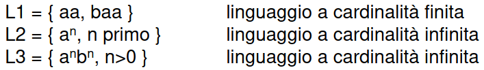

- ### CONCETTI
	- #### SINTASSI
		- regole formali che determinano le modalità di costruzione delle frasi di un linguaggio
		- espressa tramite notazioni formali
			- BNF,EBNF
			- diagrammi sintattici
	- #### SEMANTICA
		- insieme dei significati da attribuire alle frasi
		- espressa tramite
			- azioni
			- funzioni matematiche
			- formule logiche
	- #### INTERPRETE
		- accetta in ingresso frasi del linguaggio e le esegue
		- risultato: valutazione della frase
	- #### COMPILATORE
		- accetta in ingresso un programma
		- lo riscrive in un altro linguaggio (*in genere più semplice*)
	- #### ANALISI LESSICALE
		- verifica i singoli token di una frase
		- LEXER
			- analizzatore lessicale (*aggrega i singoli caratteri in token*)
	- #### ANALISI SINTATTICA
		- verifica che la sequenza di token sia corretta
		- PARSER
			- analizzatore sintattico (*genera una rappresentazione interna della frase*)
	- #### ANALISI SEMANTICA
		- determina il significato di una frase (*associa a una determinata frase delle azioni da eseguire*)
		- funzione che associa a ogni parola del linguaggio un concetto
- ### DEFINIZIONI
	- #### ALFABETO
		- insieme finito e non vuoto di simboli atomici
	- #### STRINGA
		- sequenza di simboli (*elemento del prodotto cartesiano A^n*)
		- epsilon = stringa vuota
	- #### LINGUAGGIO
		- dato un alfabeto A un linguaggio è **un insieme di stringhe costruite sull'alfabeto A**
		- #### FRASE
			- stringa appartenente al linguaggio
		- #### CARDINALITÀ
			- numero di frasi di un linguaggio
		- ##### ESEMPI
			- 
				-
		- #### CHIUSURA A*
			- insieme **infinito** di tutte le stringhe ottenibili dall'alfabeto A
		- #### CHIUSURA POSITIVA A+
		- ((642adc10-ea80-4365-8226-242194ebe179)) esclusa la stringa vuota
- come definire il sottoinsieme di ((642adc10-ea80-4365-8226-242194ebe179)) che definisce uno specifico linguaggio?
- [[GRAMMATICA FORMALE]]