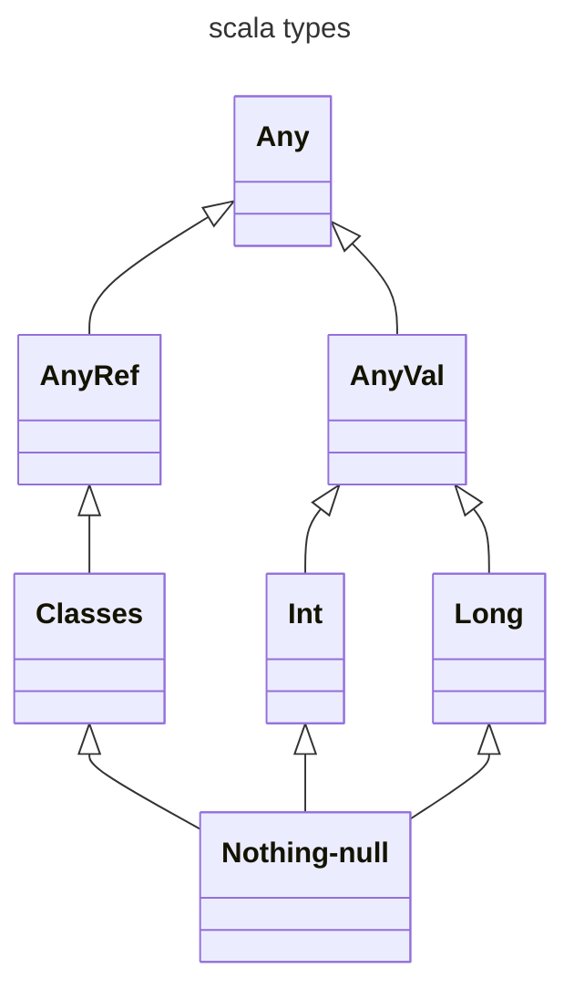
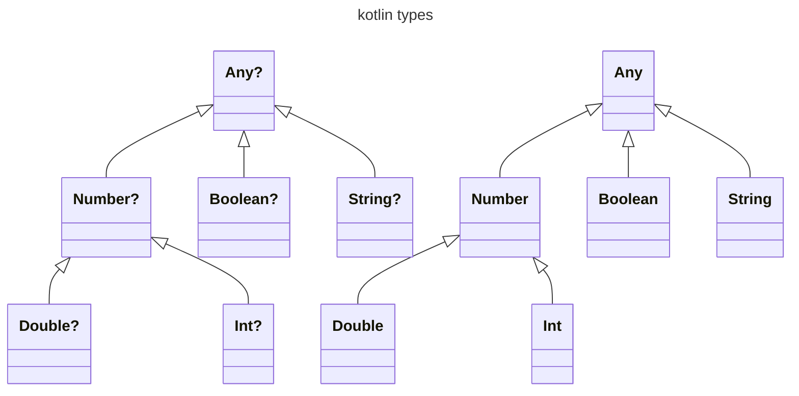

# LINGUAGGI BLENDED

Sono linguaggi frutto di un mix intelligente fra i vecchi paradigmi e gli approcci dei linguaggi funzionali senza forzare la mano verso questi ultimi l'asciando allo sviluppatore la possibilita di scegliere come approcciare il problema, due degli esempi principali sono [scala](https://www.scala-lang.org/) e [kotlin](https://kotlinlang.org/)

## CARATTERISTICHE

Sia scala che kotlin sono pensati per poter interoperare con java (*compilano in bytecode eseguibile dalla JVM ma non solo*) inoltre alcune delle caratteristiche ereditate dal modello funzionale sono:

- funzioni come [first class entities](PROCESSI_COMPUTAZIONALI.md#FUNZIONI%20COME%20FIRST%20CLASS%20ENTITIES) 
- tutto e un oggetto (*funzioni incluse*)
- distinzione fra variabile e valore (`var`/`val`)
- le strutture di controllo sono espressioni

> [!NOTE] In particolare in scala ogni metodo e un operatore e viceversa

```scala
case class Vec(x: Double) {
  def sumVec(that: Vec) = Vec(this.x + that.x);
}

val a = Vec(1.0);
val b = Vec(2.0);
// qui la funzione a un argomento sumVec viene chiamata come se fosse un operatore, molto figo :)
println(a sumVec b);
```

> [!NOTE] Invece in kotlin e possibile ridefinire gli operatori esistenti ma non crearne di nuovi

## TIPI

Sia in scala che in kotlin vengono rimossi i tipi primitivi, la gerarchia di tipi ha come radice un nodo comune che si specializza in nodi specifici per gli '*oggetti valore*' e gli '*oggetti riferimento*', inoltre le gerarchie di tipi sono chiuse dal basso con un apposita classe (*scala: `notin/null`,kotlin:`nothing`*)



>[!TIP] in scala 3 `Null` e direttamente sottotipo di `Any` in questo modo si ha ottiene che nessun oggetto può essere null a meno che non sia esplicitamente sottotipo della classe `Null` :)

In kotlin non esiste solo il tipo `Nothing` e le classi sono a default esplicitamente *non nullable*, per supportare le classi nullable viene introdotta una gerarchia di tipi parallela fatta solo da valori nullable (*suffisso `?`*)



```kotlin
var x:Int = null
```
>[!ERROR] l'oggetto fa parte della gerarchia di tipi non nullable

```kotlin
var y:Int? = null;
print(y)
```
>[!SUCCESS] l'oggetto fa parte della gerarchia nullable

## FUNZIONI

Le funzioni sono introdotte da una parola chiave prefissa (*scala:`def`,kotlin:`func`*) possono essere definite anche a top level (*senza classi wrapper*)   Inoltre la specifica di tipo e postfissa a differenza di java per facilitare l'uso del **motore di type inference** (*molto avanzato*) come gia specificato le funzioni sono [first class entities](PROCESSI_COMPUTAZIONALI.md#FUNZIONI%20COME%20FIRST%20CLASS%20ENTITIES)

Inoltre entrambi i linguaggi attuano [ottimizzazione della tail recursion](PROCESSI_COMPUTAZIONALI.md#TAIL%20RECURSION%20OPTIMIZATION)

>[!NOTE] in scala e abilitata di default disattivabile con un opzione mentre in kotlin e disabilitata di default attivabile con la keyword `tailrec`

## CLASSI

Definite con la keyword class, prevedono un costruttore primario definito in linea  con la classe (*si evita boilerplate code `this.name=name`*), inoltre in scala i membri di una classe sono public per default (*a differenza di java dove hanno visibilità package*) 

### CLASSI DATI

Particolari classi adatte a catturare oggetti con soli dati per queste vengono generati automaticamente i metodi standard di supporto (`toString`,`equals`,`hashcode`) inoltre possono essere utilizzate per **effettuare pattern matching avanzato** (*scala keyword `case class` kotlin keyword: `data class`*)

## OGGETTI E PATTERN SINGLETON

Possono essere definiti oggetti senza specificarne una classe, questo consente il **pieno supporto al pattern singleton** che vengono anche utilizzati per rimpiazzare i metodi statici di una classe per mezzo di un omonimo oggetto, il **companion object**

## EVOLUZIONE DELLE INTERFACCE

Le interfacce vengono estese dal concetto java, infatti possono contenere anche codice e evitano il dilagare di adapters per '*aggiustare*' un interfaccia troppo ricca

Inoltre scala consente un'evoluzione del concetto di ereditarietà per superare il problema dell'ereditarietà multipla

## PACKAGE

I package possono essere innestati

```scala
package ed {
	package utils {
	//…
	}
}
```

L'operatore `import` può importare oggetti,classi,interfacce e altri package, inoltre e **ricorsivo sui sottopackage**

## EXTENSION METHODS

Vi e la possibilità di estendere la definizione di una classe in un altro punto aggiungendo metodi e proprietà 

```scala
extension (i: Int)
	def toFraction: Fraction = new Fraction(i)
```

```kotlin
fun Int.toFraction() = Fraction(this)
```

### DA GRANDE POTERE....

Questo rende si le classi ridefinibili dinamicamente ma riduce la leggibilità del software (*metodi definiti chissà dove, debugging più complesso*)

## "ALLEGGERIMENTI" ALLA SINTASSI

Sia scala che kotlin consentono di omettere il separatore `;` quando ovvio, inoltre scala supporta il principio d'accesso uniforme e la quiet syntax (*bidonata alla python maniera*)

[PREVIOUS](pages/LAMBDA_CALCOLO.md) [NEXT](pages/SCALA.md)
