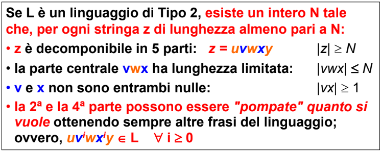
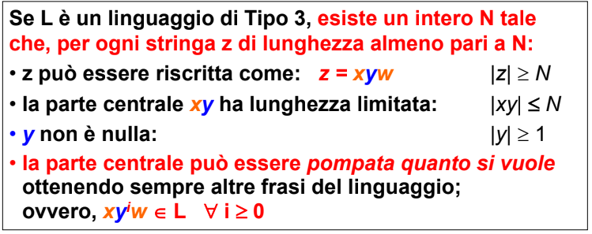

- #### PUMPING LEMMA
	- è una condizione necessaria (*ma non sufficiente*) per dimostrare che un linguaggio è di ((642c29c2-4d60-4457-b9db-7438513172a5))
	- può dimostrare la non appartenenza di un linguaggio al ((642c29c2-4d60-4457-b9db-7438513172a5))
	- si basa sul concetto che in un linguaggio infinito a un certo punto deve essere presente una stringa che si ripete questa può essere ripetuta n volte (*pompata*) per ottenere nuove stringhe del linguaggio
	- 
	- 
	- afferma che nei linguaggi di ((642c29c2-4d60-4457-b9db-7438513172a5)) e ((642c29c3-4149-4191-9f19-40157695c700)) **vi è sempre, per frasi abbastanza lunghe una parte che si ripete**
	-
	-
	-