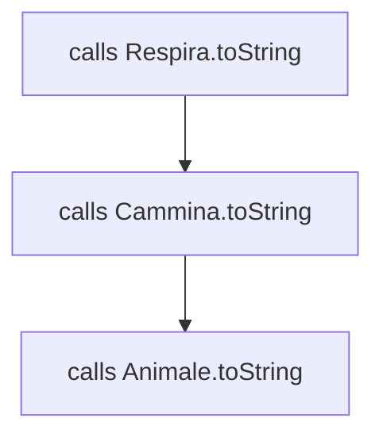

# SCALA

Scala e uno degli esempi più fiorenti di [linguaggio blended](LINGUAGGI_BLENDED.md), riprende molte caratteristiche dei linguaggi funzionali e possiede inoltre un type system forte 

## CARATTERISTICHE

Scala consente di definire in un inner scope una variabile omonima a una già esistente in un outer scope (*shadowing*)

### FUNZIONI

le funzioni sono introdotte dalla parola chiave `def` e specifica di tipo postfissa (*anziché prefissa come in C e Java*), e solitamente omessa se può essere inferita

```scala
def abs( x:Float ) : Float={
	if (x<0) -x else x
}
println(abs(-4))
```

### TYPE INFERENCE

La specifica di tipo può essere omessa in tutti quei casi in cui possa essere inferita in modo certo

```scala
//Specifica di tipo OMESSA: si può dedurre un tipo di risultato Float
def abs( x:Float ) = {
	if (x<0) -x else x
}
```

Una funzione che non restituisce nulla ha tipo di ritorno `Unit`

```scala
def hello( s:String ) = {
	println("Hello" + s)
}
hello("world")
```

scala volutamente **non supporta l’assegnamento multiplo** a tal fine, l'assegnamento è una espressione di tipo Unit che restituisce la speciale costante `()`

### STRUTTURE DI CONTROLLO

Scala ha solo cinque strutture di controllo predefinite: `if`, `while`, `for`, `try`, `match`

Questo per evitare il proliferare di costrutti, inoltre scala fornisce all'utente la possibilità di [definire nuovi costrutti](#DEFINIRE%20UN%20COSTRUTTO%20BUILTIN), in modo da arricchire il linguaggio per mezzo di nuovi costrutti anziché librerie, inoltre tutti i **costrutti sono espressioni**  in modo da favorire approcci più funzionali

### PROGRAMMA STANDALONE

In Scala, il main non può stare in una classe, che non ammette membri statici: sta in un oggetto singleton (*più OOP*)

```scala
object Test1 {
	def main(args: Array[String]) : Unit = {
		var k=0;
		while (k<5) {
			println("Iterazione " + k)
			k += 1; // l'operatore ++ non esiste
		}
	}
}
```

### NOTAZIONE INFISSA

scala consente di richiamare un dato operatore per mezzo della notazione infissa

```scala
//equivalente a scrivere Array.apply("Paperino", "Pippo", "Pluto")
val v = Array("Paperino", "Pippo", "Pluto");
//equivalente a scrivere 0.to(2)
for (i <- 0 to 2) println(v(i)) 
```

Dualmente, una lista di valori fra parentesi usata come L-value in un assegnamento sottintende una chiamata implicita al metodo update dell'oggetto ricevente ergo:

```scala
val v = Array("Paperino", "Pippo", "Pluto");
v(2) = "Quack!"
// equivale a:
v.update(2,"Quack!")
println(v(2))
```

### PROCEDURE

Una funzione che non restituisce nulla è di tipo `Unit`, (non `void`),gli argomenti sono sempre implicitamente `val`, non `var`

```scala
def change(i:Int) : Unit = { i = 2 }
```

>[!ERROR] esplode perché si sta cercando di modificare un `val`

una funzione priva di un’istruzione `return` esplicita restituisce comunque l’ultimo valore calcolato

```scala
def increment(i:Int) : Int = i+2 
println(increment(3))
```

Scala non consente di definire funzioni con un numero variabile di argomenti  ma permette di ripetere l'ultimo argomento, con una sintassi analoga alle regular expression: `*` 

```scala
def myprint(args: String*)
```
 
> [!NOTE] Attenzione ai tipi degli argomenti ripetuti: internamente alla funzione, l’argomento ripetuto è mappato su un array, quindi il tipo dell’argomento ripetuto è `Array` di quel tipo esternamente, però, il tipo argomento ripetuto è considerato diverso da un array e quindi incompatibile con esso

### OGGETTO SINGLETON

scala consente la definizione di oggetti singleton introdotti dalla parola chiave `object` anziché `class`, sono strutturalmente identici a una classe ma non definiscono un tipo perché non ne esisteranno altre istanze

```scala
object Boss {
	//Tutti i campi devono essere obbligatoriamente inizializzati
	private val name = "The Boss"; 
	//Proprietà e metodi di un singleton sono pubblici per default
	def getName() = name
}

object Main {
	def main(args: Array[String]) {
		//L'oggetto singleton è usabile senza doverlo creare esplicitamente
		println(Boss.getName()) 
	}
}
```

Un oggetto singleton può essere usato:
- da solo, come standalone object
- insieme a una classe, come suo companion object
- nella composizione di tratti

#### COMPANION OBJECT

Un oggetto companion è un particolare singleton che:

- e omonimo di una classe
- e definito nel suo stesso file

```scala
class Counter(v:Int) {
	//Accesso privilegiato al campo privato dell'oggetto companion
	Counter.howMany += 1;
}
object Counter {
	//Variabile privata dell’oggetto singleton
	private var howMany : Int = 0
}
```


### COSTRUTTORI

In Scala una classe non ha costruttori espliciti al loro posto, ha parametri di classe usati dal compilatore per generare automaticamente il costruttore primario, inoltre per ridefinire metodi ereditati e necessario il qualificatore di override

```scala
class Counter(v:Int) {
	private var value = v;
	def setValue(v:Int) = { value = v }
	def getValue() : Int= value
	//Ridefinizione di metodo
	override def toString() = "Counter di valore " + value
}
```


### FUNZIONI E CHIUSURE

Il pieno supporto alle funzioni come [first-class objects](PROCESSI_COMPUTAZIONALI.md#FUNZIONI%20COME%20FIRST%20CLASS%20ENTITIES) comporta un altrettanto pieno supporto alle [chiusure](PROCESSI_COMPUTAZIONALI.md#CHIUSURA), per cui viene preferita la chiusura lessicale e le variabili libere **vengono chiuse per mezzo di riferimenti alle variabili esterne**, ciò significa che risentono dei cambiamenti ad esse

### CONVERSIONI IMPLICITE

Come in C++, scala consente di definire conversioni implicite di tipo che saranno applicate automaticamente, questo torna utile per permettere l'uso commutativo degli operatori

```scala
class Frazione(val num:Int,val den:Int){
	// lancia IllegalArgumentException se violata
	require(den!=0)

	//costruttore ausiliario
	def this(n:Int) = this(n,1)

	// tail recursion ottimizzata
	def calcMCD(a:Int, b:Int) : Int = if (a%b==0) b else calcMCD(b,a%b)

	//operatore + frazione
	def +(i:Int): Frazione = sum(new Frazione(i))

	def sum(f: Frazione): Frazione = {
		val n = this.num * f.den + this.den * f.num;
		val d = this.den * f.den;
		//tonde opzionali, principio di accesso uniforme
		return new Frazione(n,d).minTerm;
	}

	def minTerm : Frazione = {
		val mcd = calcMCD(num.abs, den.abs);
		val nuovoNum = num/mcd;
		val nuovoDen = den/mcd;
		new Frazione(nuovoNum, nuovoDen);
	}
}
```

Ciò consente di scrivere espressioni come `println(f1+3)`
MA NON `3+f1` perché `+` è un metodo di `Frazione`, non di `Int`

```scala
class Frazione(val num:Int,val den:Int){
	// lancia IllegalArgumentException se violata
	require(den!=0)

	//costruttore ausiliario
	def this(n:Int) = this(n,1)

	// tail recursion ottimizzata
	def calcMCD(a:Int, b:Int) : Int = if (a%b==0) b else calcMCD(b,a%b)

	//operatore + frazione
	def +(i:Int): Frazione = sum(new Frazione(i))

	def sum(f: Frazione): Frazione = {
		val n = this.num * f.den + this.den * f.num;
		val d = this.den * f.den;
		//tonde opzionali, principio di accesso uniforme
		return new Frazione(n,d).minTerm;
	}

	def minTerm : Frazione = {
		val mcd = calcMCD(num.abs, den.abs);
		val nuovoNum = num/mcd;
		val nuovoDen = den/mcd;
		new Frazione(nuovoNum, nuovoDen);
	}
	override def toString = if(den==1) ""+num else num+"/"+den;
}

//companion object con la definizione del metodo di conversione 
object Frazione {
	def main(args: Array[String]) : Unit = {
		val f = new Frazione(3,5)
		println(f + 3) // SI', con operator+ overloaded
	}
}
```

### ECCEZIONI

Le eccezioni in scala sono simili a java, con alcune differenze tra cui:
- anche l'espressione throw ha un tipo di ritorno: `Nothing` che non sarà mai valutata e quindi non produrrà mai un "*valore*"
- la clausola catch opera per pattern matching
- anche il costrutto `try/catch/finally` è un'espressione che restituisce il valore del ramo `try`, se esso ha avuto successo altrimenti restituisce il valore di uno dei rami `catch`, se l'eccezione è stata catturata e non restituisce alcun valore, se l'eccezione è stata lanciata ma non catturata

>[!NOTE] a differenza di Java, l'eventuale valore computato nel finally non è considerato e va quindi perduto.

```scala
object TestExceptions {
	def main(args: Array[String]) : Unit = {
		val myurl = getURL("https://carnivuth.github.io/linguaggi_modelli_computazionali/")
		val bleah = getURL("carnivuth.github.io/linguaggi_modelli_computazionali/")
		println(myurl)
	}
	def getURL(url: String) = {
		try {
			new java.net.URL(url)
		} catch {
			case e: java.net.MalformedURLException => println("bleah")
		}finally println("done.")
	}
}
```

>[!NOTE] ogni `case` cattura un caso attraverso pattern matching

### PATTERN MATCHING

In scala e possibile "*smontare*" un oggetto (*object destructuring*) in un insieme di componenti che possono poi essere riferite successivamente 

```scala
val coppia = (12, "dozzina")
val (value,name) = coppia
println(value)
println(name)
```

Questo torna molto utile insieme al `for` per accedere in maniera pulita alle componenti di un oggetto

```scala
val persone=(("mario","rossi"),("mario","rossi"))
for ((name,surname) <- persone) print(surname+" "+name)
```
### COSTRUTTO MATCH

scala rimpiazza il costrutto switch con un ben più potente costrutto `match` con le seguenti caratteristiche:

- semantica a **casi distinti**, senza "fall through" (niente break)
- nel costrutto `case` non solo sono ammesse etichette scalari o stringhe, ma anche selettori evoluti sfruttando il pattern matching su variabili  o costruttori di istanze

```scala
case class Point(val x:Int,val y:Int){}

object Point{
	def main(args:Array[String]): Unit ={
		var arg:AnyRef=Point(3,5)
			println(
				arg match{
				case i:Integer => "Intero";
				// con la possibilita di destrutturare l'oggetto
				case Point(x,y) => "punto "+x+","+y;
				case o:Any => "oggetto";
				}
			
			)
	}
}
```

## DEFINIRE UN COSTRUTTO BUILTIN

Scala ha tutti gli strumenti per consentire la definizione di costrutti builtin:

- block like syntax
- [currying](JAVASCRIPT.md#CURRYING)
- [call by name](PROCESSI_COMPUTAZIONALI.md#ALTERNATIVA,%20MODELLO%20CALL%20BY%20NAME)
- [chiusura](PROCESSI_COMPUTAZIONALI.md#CHIUSURA)

quindi per creare il costrutto `repeat`:

```scala
// si sfrutta il curring per definire una funzione a 2 argomenti
def repeat(n:Int)(expr: =>Unit):Unit={
	//tail recursion per ripetere l'azione dove si richiama la funzione esterna della chiusura
	expr; if (n>1) repeat(n-1)(expr)
}

//il chiamante puo sfruttare la block like sintax e il costrutto e completato
repeat(3){print("hi")}
```

## EREDITARIETÀ ESTESA: I TRATTI

Scala estende il concetto delle interfacce java con i **tratti**, un tratto si definisce come segue

```scala
trait tratto{}
```

Come per le interfacce java un tratto non può generare istanze, ma al contrario delle stesse può definire codice e estendere altre classi 

### MIXING DEI TRATTI

un tratto può ereditare sia da un altro tratto che da una classe e una stessa classe può comporsi di più tratti:

```scala
class Animale(){}
trait respira extends Animale{}
trait cammina extends Animale{}
class Cane extends Animale with respira with cammina(){}
```

>[!NOTE] In questo caso essendo che i tratti estendono direttamente la classe `Animale` possono essere composti solo con classi e tratti che **estendono la stessa classe**

I tratti possono essere composti anche in fase di istanziazione di un oggetto:

```scala
class Animale(){}
trait respira extends Animale{}
trait cammina extends Animale{}
val a = new Animale with cammina()
val b = new Animale with respira()
```

### TRATTI E OVERRIDE DI METODI

Un tratto puo a sua volta effettuare l'override di metodi della classe da cui eredita, per evitare ambiguita in caso di tratti che estendano lo stesso metodo, **la risoluzione della keyword `super` viene effettuata a runtime**

```scala
class Animale(nome:String){
	override def toString():String={return this.nome}
}
trait Respira extends Animale{
	override def toString():String={return super.toString + " respira"}
}
trait Cammina extends Animale{
	override def toString():String={return super.toString + " cammina"}
}
println((new Animale("asdrubale") with Cammina with Respira).toString())
println((new Animale("ubaldo") with Respira with Cammina).toString())
```

### RISOLUZIONE DI `super` PER MEZZO DELLA LINEARIZZAZIONE

e possibile comporre i tratti perché la risoluzione delle catene di `super` avviene a runtime sfruttando il fatto che i tratti **non possono avere costruttori** di conseguenza non ci sono ambiguità nella catena risolutiva


### ALGORITMO DI LINEARIZZAZIONE

data una classe definita come segue

```scala
class A extends B with C with D //.....
```

L'algoritmo di linearizzazione procede come segue:

- si considera al catena della classe padre `B` (*che e sempre e solo una*)
- si aggiungono se non presenti le catene dei tratti (*da sinistra a destra*)

## COLLECTIONS

In scala le collection sono fornite in due versioni, (*per non scoraggiare troppo le migrazioni di codebase da java*) 

- mutable (*necessario import esplicito `scala.collection.mutable`*)
- immutable (*importate di default*)

tra le collection sono disponibili `List` `Array` `Tuple` `Set` `Map` 

## VARIANZA E COVARIANZA

In scala e possibile specificare la varianza dei tipi parametrici

```scala
class Coda[+T](...) {
def append[U >: T](element: U) {..}
}
```

## TIPO `Option`

Scala introduce il tipo `Option` come analogo degli optional di java, questo per evitare argomenti passati come null (*si ricorda che ciò in scala non  e possibile per la [gerarchia di tipi](LINGUAGGI_BLENDED.md#TIPI)*) 

## EXTRACTORS

Le funzionalità di [pattern matching](#PATTERN%20MATCHING) di scala come definite sopra sono utilizzabili solo per mezzo di [classi dati](LINGUAGGI_BLENDED.md#CLASSI%20DATI), per poterle utilizzare anche con oggetti generati da classi normali scala mette a disposizione gli **extractors**,  ovvero oggetti che definiscono un metodo `unapply()` duale di `apply()` che estrae i valori di un oggetto

Il metodo in questione deve essere definito al difuori della classe interessata (il miglior candidato risulta essere il [companion object](#COMPANION%20OBJECT))

```scala
// oggetto companion
object Persona {
	def unapply(p:Persona) : Option[(String,Int)] =Some(p.nome,p.year) 
}

// utilizzo dell extractor
def filtra(x : AnyRef) =
	x match {
		case Persona(n, a) => a
		case _ => "non mi piace"
}
```


## INTEROPERABILITÀ CON `JAVA`

Scala, compilando in bytecode  e eseguendo sulla JVM e direttamente interoperabile con java, infatti alcune delle funzionalita introdotte da scala sono mappate *quasi* in corrispettive astrazioni java

- gli [oggetti singleton](#OGGETTO%20SINGLETON) vengono mappati su classi con metodi statici
- i [tratti](#EREDITARIETÀ%20ESTESA%20I%20TRATTI) implementati come una interfaccia con una classe accessoria per il corpo dei metodi
- i tipi generici si mappano quasi interamente sui tipi generici di java

| SCALA                         | JAVA                                          |
| ----------------------------- | --------------------------------------------- |
| usare classi java             | usare classi scala                            |
| estendere classi java         | usare oggetti scala (*con delle limitazioni*) |
| usare framework java `javaFX` | usare classi scala con funzioni e chiusure    |

## [INTERPRETI](INTERPRETI.md) IN SCALA: LA LIBRERIA PARSER COMBINATORS

La libreria scala [`parser combinators`](https://index.scala-lang.org/scala/scala-parser-combinators) consente la creazione di parser custom per grammatiche anche **non deterministiche** (*a scapito delle performance*).

La libreria definisce i seguenti operatori:

- `|` per esprimere l'alternativa
- `rep()` per esprimere la ripetizione di un elemento
- `~` per esprimere la concatenazione
- `()` per raggruppare

La grammatica viene definita estendendo la classe java `JavaTokenParser` e le regole di produzione vengono mappate su funzioni scala

```scala
class MyGrammar extends JavaTokenParsers {
	def A: Parser[Any] = A~rep("+"~B | "-"~B)
	def B: Parser[Any] = B~rep("*"~B | "/"~B)
	def C: Parser[Any] = floatingPointNumber | "("~A~")"
}
```

la semantica può essere aggiunta con l'operatore `^^` 

```scala
class MyGrammar extends JavaTokenParsers {
	def A: Parser[Any] = A~rep("+"~B | "-"~B)^^ {
		// funzione che implementa la semantica
		println(a)
	}
}
```

In caso di grammatiche [ll(1)](GRAMMATICHE_LLK.md#GRAMMATICHE%20$LL(k)$) la libreria genera comunque un parser in grado di fare backtracking, per evitare l'inefficienza e utile specificare che non e necessario supportarlo con l'operatore `!`


[PREVIOUS](pages/LINGUAGGI_BLENDED.md)
