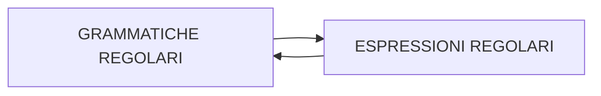

# GRAMMATICHE REGOLARI (TIPO 3)

grammatiche le cui  produzioni ammettono un solo simbolo non terminale nel membro di destra.I linguaggi generati dalle grammatiche regolari coincidono con quelli descritti da [[ESPRESSIONI REGOLARI]]

	

- ad ogni grammatica corrisponde una macchina in grado di riconoscerne i linguaggi
