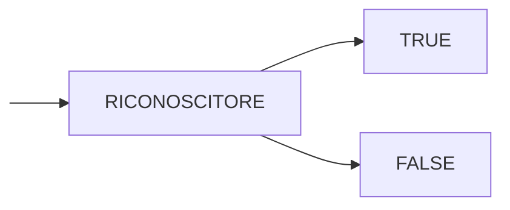

# INTERPRETI

Riconoscere se una frase appartiene o meno a un linguaggio non e sufficiente, e necessario applicare anche una semantica alle frasi riconoscute

Gli interpreti suggeriscono quindi di usare la struttura generata da uno scanner/lexer per poi applicare un significato alle frasi, in questo caso la sequenza di derivazione delle frasi e fondamentale in quanto da essa dipende la semantica applicata (*[ricordiamo il caso della ricorsione sinistra](GRAMMATICHE_TIPO_2.md#PERCHÉ%20NON%20ELIMINARE%20SEMPRE%20LA%20RICORSIONE%20SINISTRA)*)

## DESCRIVERE LA SEMANTICA

E necessario scrivere un formalismo che ci consenta di esprimere la semantica da associare alle singole frasi riconosciute dal parser

Questo viene fatto per mezzo di una funzione di interpretazione che mappi gli elementi del linguaggio (*DOMINIO*) all'insieme dei possibili significati (*CODOMINIO*)

Per implementare una tale funzione si sfrutta la struttura data dalla grammatica e si **esprime una funzione per ogni regola sintattica**:

## INTERPRETAZIONE DIFFERITA (ABSTRACT SYNTAX TREE)

Nel caso non si intenda eseguire immediatamente la semantica ma generare un output eseguibile in un secondo momento (*compilatori/linguaggi misti*) e necessario definire una rappresentazione della frase interpretata (*solitamente un albero*)

si potrebbero usare gli [alberi di derivazione](GRAMMATICHE_TIPO_2.md#ALBERI%20DI%20DERIVAZIONE) ma questi risultano ridondanti e inefficienti, si ricorre quindi a una rappresentazione ridotta chiamata **abstract syntax tree** 

Alcuni degli elementi che possono essere rimossi dal albero sono:

- nodi terminali privi di significato semantico (*punteggiatura*)
- nodi non terminali con un unico figlio (*$EXPR\rightarrow NUM$*)
- nodi terminali senza significato (parentesi)

## SINTASSI ASTRATTA

Occorre un formalismo per poter descrivere la struttura [AST](#INTERPRETAZIONE%20DIFFERITA%20(ABSTRACT%20SYNTAX%20TREE)), questo viene fatto per mezzo di una sintassi che descrive l'output del parser questa non deve essere non ambigua in quanto descrive l'output del parser, non lo guida al riconoscimento della frase

Di conseguenza, l'output del parser sara un albero composto da istanze di una data classe in base a cosa viene definito dalla sintassi dell' AST
