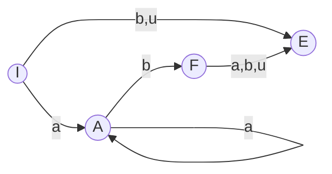

# RICONOSCERE [LINGUAGGI DI TIPO 3](GRAMMATICHE_REGOLARI.md), L'AUTOMA A STATI FINITI

Per riconoscere linguaggio di livello 3 e necessario un **automa a stati finiti**, questo può essere definito come

$$
<A,S,S_0,F,sfn^*>
$$

dove:

- $A$ e un alfabeto
- $S$ e l'insieme degli stati
- $S_0$  e lo stato iniziale ($S_0 \in S$)
- $F$ e l'insieme degli stati finali
- $sfn^*$ e la funzione di stato che computa lo stato futuro del sistema

la funzione $sfn$ definisce a partire dallo stato iniziale $S_0$ l'evoluzione del sistema in funzione delle sequenze in ingresso $x$

### LINGUAGGI E RICONOSCITORI

Un linguaggio di di tipo 3 e **non vuoto**  se il riconoscitore accetta una stringa x di lunghezza $L_x$ minore del numero di stati $N$

Un linguaggio di di tipo 3 e **infinito** se il riconoscitore accetta una stringa x di lunghezza $N \lt L_x \lt 2N$ dove $N$ e il numero di stati del automa
